# ایمونولوژی بیماری‌های اتوایمیون غدد آندوکرین (پانکراس و تیروئید)

## 1. شالوده تولرانس ایمونولوژیک و ریشه‌شناسی شکست آن

> [!definition] مفهوم تولرانس ایمونولوژیک (Immunological Tolerance)
> عدم پاسخ‌دهی اختصاصی دستگاه ایمنی نسبت به یک آنتی‌ژن خاص (به‌ویژه آنتی‌ژن‌های خودی یا *Self-antigens*) در اثر برخورد قبلی با آن آنتی‌ژن؛ تضمین‌کننده بقای بافت‌های سوماتیک خودی و عدم تهاجم ایمنی.

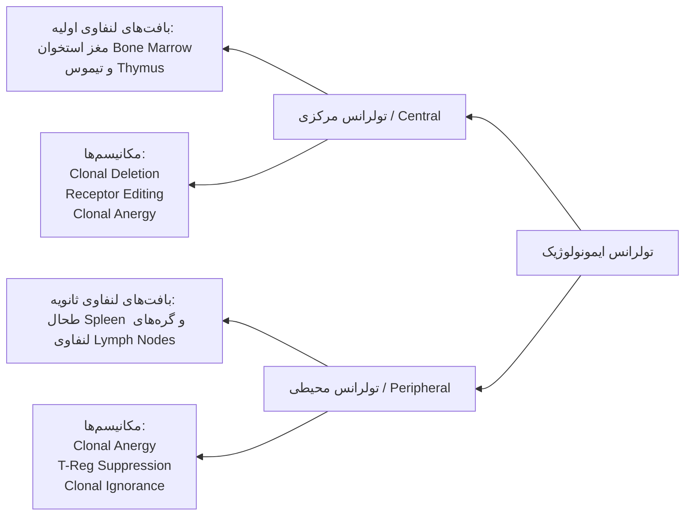

### مکانیسم‌های کلیدی استقرار و بقای تولرانس (T-Cells و B-Cells)
1. **حذف کلونی (Clonal Deletion):** مرگ برنامه‌ریزی‌شده سلول‌های اتوراکتیو طی فرآیند انتخاب منفی (*Negative Selection*) در اعضای اولیه لنفاوی.
2. **ویرایش گیرنده (Receptor Editing):** بازآرایی مجدد ژن‌های زنجیره سبک در لنفوسیت‌های B خودواکنش‌گر نابالغ در مغز استخوان.
3. **آنرژی کلونی (Clonal Anergy):** عدم پاسخ‌دهی عملکردی لنفوسیت در غیاب سیگنال هم‌محرک (*Co-stimulation*) مانند برهم‌کنش B7-CD28.
4. **نادیده‌انگاری کلونی (Clonal Ignorance):** بقای لنفوسیت‌های با تمایل پیوندی پایین به علت دسترسی محدود به آنتی‌ژن در شرایط فیزیولوژیک.
5. **سرکوب توسط سلول‌های تنظیمی (Suppression by Tregs):** مهار فعال لنفوسیت‌های واکنش‌گر توسط سلول‌های *CD4+ CD25+ FoxP3+*.

---

### علل و مکانیسم‌های شکست تولرانس (Breakdown of Tolerance)

> [!danger] اصل بنیادین پاتوژنز اتوایمیونیتی
> بیماری اتوایمیون همواره محصول مستقیم **شکست تولرانس و از دست رفتن پایش خودی** است؛ رخدادی که حاصل برهم‌کنش هم‌زمان آسیب‌پذیری ژنتیکی و عوامل محرک محیطی است.

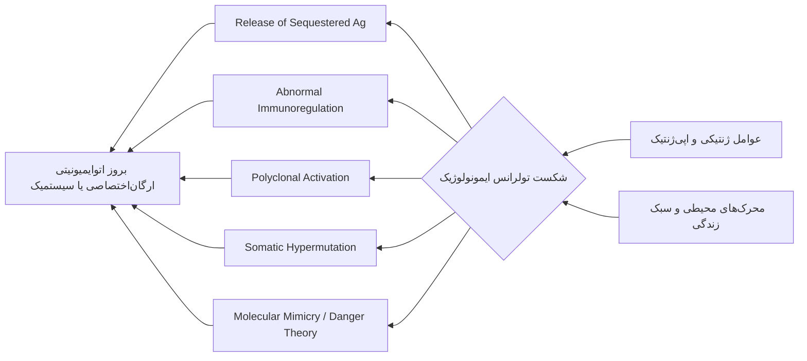

#### فهرست جامع مکانیسم‌های مولکولی شکست تولرانس:
1. **آزاد شدن آنتی‌ژن‌های پنهان (Release of Sequestered Antigens):** آسیب تروماتیک یا عفونی بافت و مواجهه سیستم ایمنی با آنتی‌ژن‌های محصور (*مانند پروتئین‌های داخل‌سلولی بتا و تیروئید*).
2. **اختلال در تنظیم ایمنی (Abnormal Immunoregulation):** نقص عملکردی یا عددی لنفوسیت‌های **T-Reg** و اختلال در فعالیت سایتوکاینی سلول‌های **Th**.
3. **فعال‌شدن پلی‌کلونال لنفوسیت‌ها (Polyclonal Lymphocyte Activation):** ترشح سوپرآنتی‌ژن‌ها یا میتوژن‌های میکروبی و تحریک هم‌زمان کلون‌های خاموش لنفوسیتی فارغ از ویژگی آنتی‌ژنی.
4. **بیش‌جهش سوماتیک نابجا (Somatic Hypermutation):** تغییر تمایل پیوندی گیرنده آنتی‌بادی به سوی سلف‌آنتی‌ژن‌ها در مراکز زایای فولیکول‌های لنفاوی.
5. **تئوری خطر (Danger Theory):** آزادسازی **DAMPs** و آلارمین‌ها متعاقب نکروز سلولی و فعال‌سازی گیرنده‌های شناسایی الگو (**PRRs**).
6. **فاکتورهای ژنتیکی (Genetic Factors):** پلی‌مورفیسم‌های اختصاصی در لکوس‌های موثر بر شناسایی آنتی‌ژن و آستانه فعال‌سازی سلول‌های ایمنی.
7. **وضعیت هورمونی (Hormonal Status):** تفاوت‌های وابسته به جنس در غلظت استروژن، پروژسترون و آندروژن‌ها در تنظیم شدت پاسخ ایمنی.

---

### ماتریس عوامل اتیولوژیک: بستر ژنتیک در برابر محرک محیطی

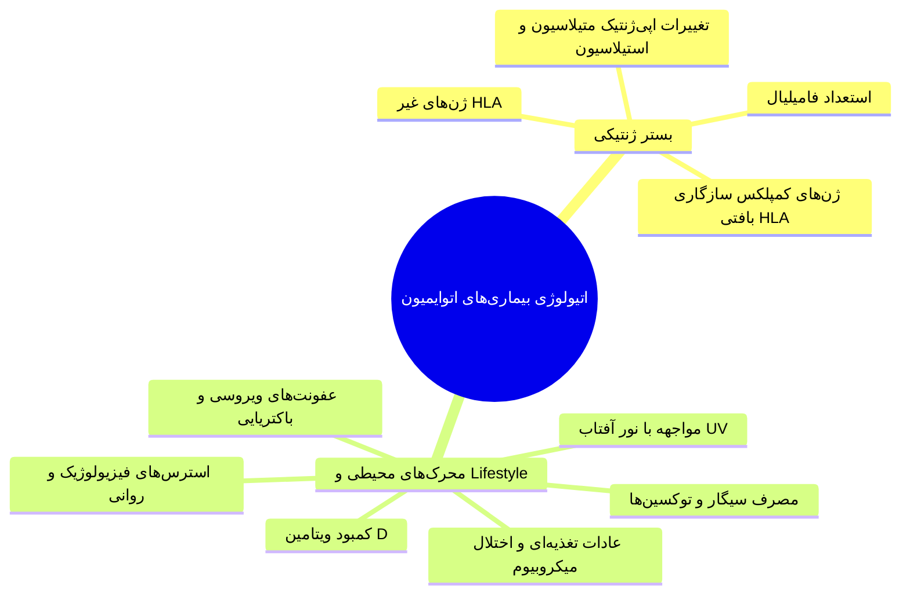

---

## 2. پانکراس و دیابت ملیتوس نوع 1 (T1D / IDDM)

> [!definition] دیابت ملیتوس (Diabetes Mellitus)
> گروه ناهمگونی از اختلالات متابولیک مزمن با ویژگی شاخص **هایپرگلایسمی پایدار** و **عدم تحمل گلوکز (Glucose Intolerance)** ناشی از اختلال در ترشح، اثر یا هر دو مکانیسم انسولین، همراه با عوارض ثانویه عروقی و ارگانی.

### معیارهای تشخیصی بیوشیمیایی (آزمایشگاهی)
* **قند خون ناشتا (FBS):** مقادیر ≤ **126 mg/dL**.
* **هموگلوبین گلیکوزیله (HbA1c):** مقادیر ≤ **7.5%** (*در معیارهای بالینی ارائه شده در مرجع کلاس*).
* **تست تحمل گلوکز خوراکی (OGTT):** قند خون دو ساعت پس از بارگیری ≤ **200 mg/dL**.

### نمادها، نشانه‌ها و تظاهرات بالینی (Signs & Symptoms)
1. **پلی‌اوری (Polyuria):** تکرر ادرار ناشی از دیورز اسموتیک ناشی از گلوکوزوری.
2. **پلی‌دیپسی (Polydipsia):** پرنوشی و تشنگی مفرط در پاسخ به دهیدراتاسیون و هایپراسمولاریته.
3. **پلی‌فاژی (Polyphagia):** پرخوری ثانویه به گرسنگی سلولی در اثر عدم ورود گلوکز به بافت‌های وابسته به انسولین.
4. **کتواسیدوز دیابتی (DKA):** عارضه حاد ناشی از شیفت به لیپولیز شدید، اکسیداسیون اسیدهای چرب و انباشت اجسام کتونی؛ دارای پتانسیل کشندگی بالا.

---

### طبقه‌بندی تیپولوژی دیابت

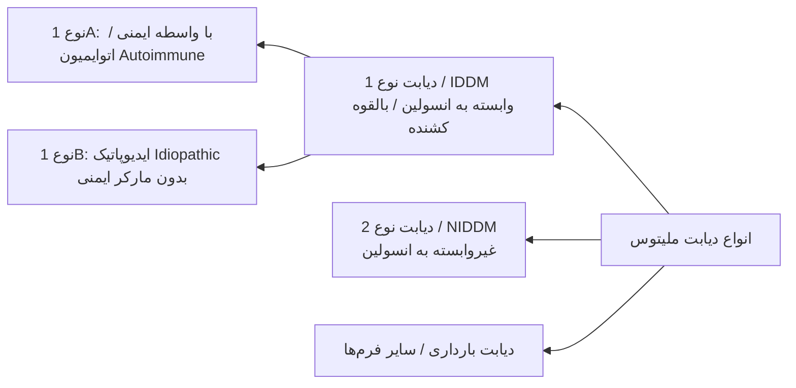

---

## 3. ایمونوپاتوژنز سلولی و مولکولی T1D

> [!important] کلیدی‌ترین نکته پاتوفیزیولوژی T1D
> تخریب سلول‌های بتای لانگرهانس **یک فرآیند تماماً سلول‌محور (Cell-mediated)** تحت هدایت مستقیم لنفوسیت‌های **T اتوراکتیو** است. این بیماری **تنها با انتقال سلول‌های T** قابلیت بازتولید در مدل‌های حیوانی را دارد و **با انتقال آنتی‌بادی منتقل نمی‌شود**. اتوآنتی‌بادی‌ها صرفاً ابزار غربالگری و پیش‌بینی (*Prediction*) هستند نه عامل اجرایی تخریب اولیه!

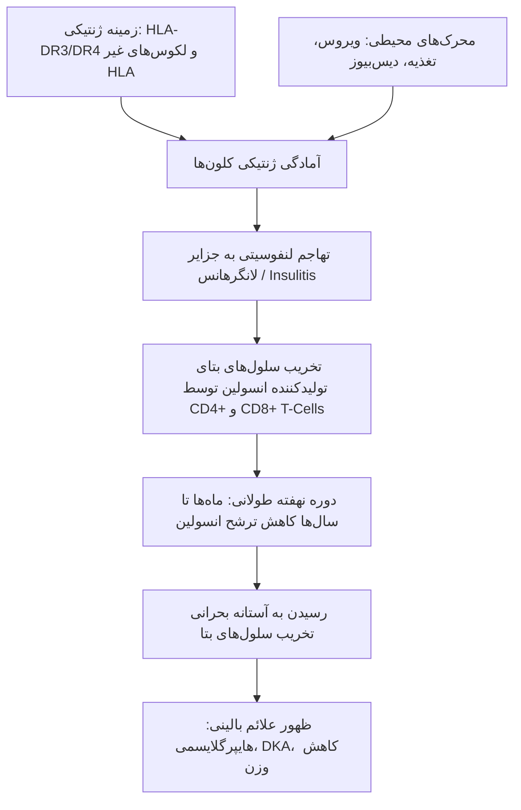

> [!warning] تله امتحانی: سیر زمانی تخریب بافتی
> پروسه اتوایمیونیتی و تخریب انتخابی سلول‌های بتا **ماه‌ها تا سال‌ها پیش از شروع علائم بالینی** آغاز می‌گردد. علائم آشکار تنها زمانی تظاهر می‌یابند که توده عملکردی سلول‌های بتا به زیر آستانه فیزیولوژیک جهت حفظ هومئوستاز گلوکز سقوط کرده باشد.

---

### شبکه سلول‌های عرضه‌کننده آنتی‌ژن (APCs) و فعال‌سازی جانبی

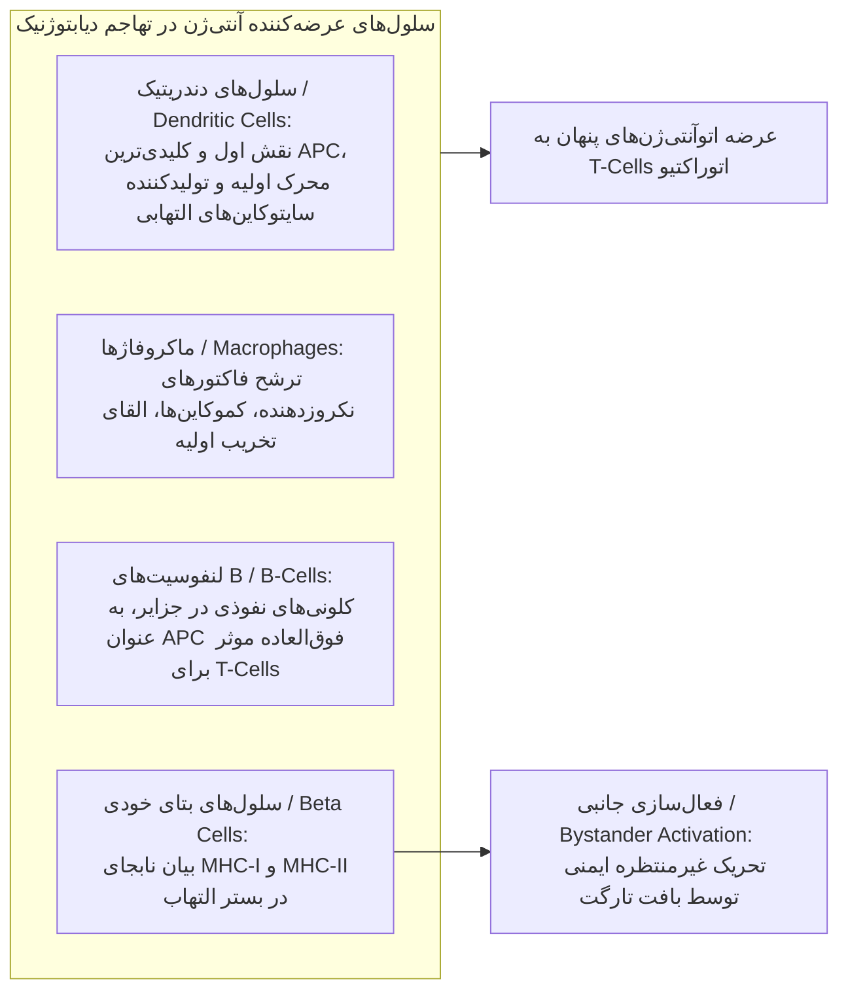

* **پدیده پاشش اپیتوپ (Epitope Spreading):** آغاز پاسخ اتوایمیون با تحریک یک اپیتوپ مجزا از یک آنتی‌ژن منفرد (*مانند انسولین*) و گسترش دامنه تهاجم به سایر اپیتوپ‌های همان پروتئین یا سایر آنتی‌ژن‌های بافتی (*مانند GAD65 و ZnT8*)؛ تشدید تصاعدی آسیب بافتی با افزایش بار ارتشاح لنفوسیت‌های *CD4+* و *CD8+*.

---

### رپرتوار آنتی‌ژن‌های هدف در دیابت نوع 1

> [!definition] اتوآنتی‌ژن‌های اصلی پانکراس
> پروتئین‌های اختصاصی مستقر در وزیکول‌های ترشحی، غشا یا سیتوپلاسم سلول‌های بتا که توسط کلون‌های لنفوسیتی اتوراکتیو به عنوان تارگت شناسایی می‌شوند.

1. **انسولین و پروانسولین (Insulin / Proinsulin):**
   * **جایگاه پاتوژنیک:** *نخستین تارگت اختصاصی* و مهم‌ترین سلف‌آنتی‌ژن بافتی در فاز شروع بیماری.
   * **مکانیسم:** اپیتوپ‌های اختصاصی آن عامل اولیه فراخوانی، پولاریزاسیون و اینفیلتراسیون لنفوسیت‌های T دیابتوژنیک به بافت درون‌ریز پانکراس هستند.
2. **گلوتامیک اسید دکربوکسیلاز (GAD):**
   * **ایزوفرم‌ها:** دو ایزوفرم ساختاری شامل **GAD65** (*فرم غالب در انسان*) و **GAD67** (*فرم غالب در جوندگان/موش*).
   * **نکته تشخیصی امتحانی:** جداسازی کلون‌های لنفوسیت T اختصاصی GAD دشوار است، اما **اتوآنتی‌بادی ضد GAD65** اصلی‌ترین نشانگر سرمی پایدار در پیش‌بینی (*Prediction*) فرآیند بیماری است.
3. **ترانسپورتر روی 8 (ZnT8 / Zinc Transporter 8):**
   * **عملکرد بیولوژیک:** پروتئین ترابری اختصاصی زینک مستقر بر روی غشای گرانول‌های ذخیره‌ای انسولین در تیروسیت‌ها و سلول‌های بتا؛ دخیل در متراکم‌سازی و ترشح انسولین.
   * **اهمیت بالینی ممتاز:** مارکر سطح سلولی با تاییدیه **FDA-Approved**؛ فاکتور و بیومارکر بیولوژیک تعیین‌کننده جهت پیش‌بینی قطعی وقوع بیماری در افراد فاقد علامت بالینی.
4. **تیروزین فسفاتازهای اینسولینوما (IA-2 و IA-2β):**
   * پروتئین‌های غشایی گرانول‌های ترشحی با نام مترادف **ICA512**؛ آنتی‌بادی‌های ضد آن‌ها شاخص فاز تخریب پیشرفته جزایر هستند.
5. **فاکتور رونویسی PDX-1 و سایر آنتی‌ژن‌های فرعی:**
   * تنظیم‌کننده تمایز پانکراس و دخیل در حفظ فنوتیپ ترشحی سلول‌های بتا.

---

### ژنتیک دیابت نوع 1: ژن‌های HLA و غیر HLA

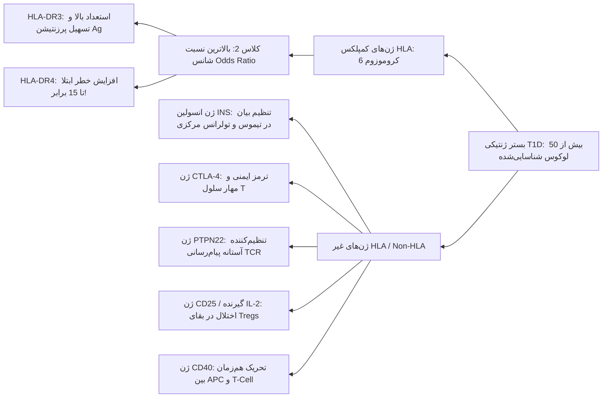

> [!important] نکته تفسیری پیرامون دوقلوهای تک‌تخمکی (Monozygotic Twins)
> مطالعات ژنومیک گسترده اثبات می‌کنند که آلل‌های حساسیت ژنتیکی هرگز به تنهایی تعیین‌کننده نیستند؛ در دوقلوهای منوزایگوت تطابق ابتلای کامل وجود ندارد، که این امر وابستگی قطعی بروز نهایی دیابت نوع 1 به **محرک‌های تریگرکننده محیطی** را تایید می‌نماید. فاکتور ژنتیکی تنها ریسک ابتلا را از سطح **0.4% در جامعه عمومی** به چندین برابر افزایش می‌دهد.

> [!danger] تله تستی فوق‌العاده حیاتی: نقص مطلق T-Reg و سندرم IPEX
> جهش غیرفعال‌کننده در ژن فاکتور رونویسی *FoxP3* بر روی کروموزوم X موجب توقف کامل تکوین سلول‌های **T-Reg** و ایجاد سندرم شدید **IPEX** (*Immune dysregulation, Polyendocrinopathy, Enteropathy, X-linked*) می‌گردد؛ یکی از تظاهرات سیستمیک اولیه و مهلک این سندرم، **دیابت نوع 1 نوزادی (Neonatal Diabetes)** است.

---

## 4. فاکتورهای محیطی دیابت: مکانیسم‌های مولکولی و Mimicry

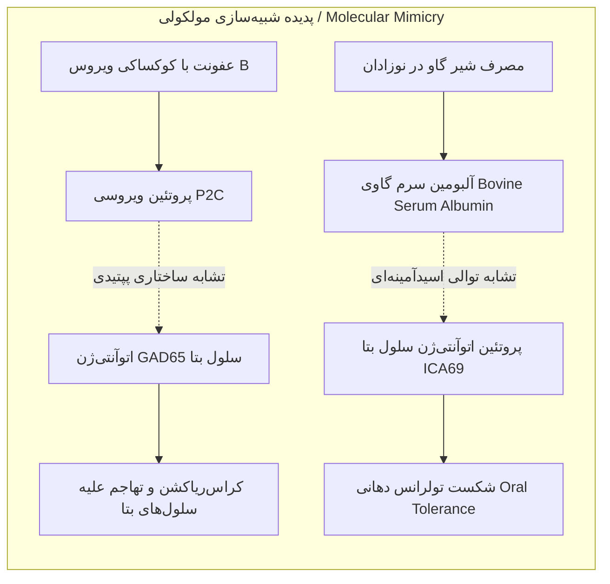

### 1. شبیه‌سازی مولکولی در انتروویروس‌ها (کوکساکی B و روبلا)
* **کوکساکی ویروس گروه B (Coxsackievirus B):** مستقیماً از بافت پانکراس افراد مبتلا ایزوله شده است.
* **پروتئین ویروسی P2C:** پپتید ساختاری ویروسی با توالی بسیار مشابه آنزیم **GAD65**.
* **مکانیسم واکنش متقاطع (Cross-Reaction):** آنتی‌بادی‌ها و سلول‌های T القاشده علیه پروتئین P2C با آنتی‌ژن خودی GAD65 واکنش داده و توسط مولکول **HLA-DR3** عرضه می‌شوند.
* **عفونت سرخجه (Rubella):** دومین عفونت ویروسی اثبات‌شده با نقش تریگر در شکست تولرانس پانکراس.

### 2. برهم‌خوردن تعادل سایتوکاینی و مهار عملکردی T-Reg توسط ویروس‌ها
* فعال‌سازی گیرنده‌های شبه تول (**TLRs**) متعاقب ورود ویروس، سبب مهار فعالیت سایتوپاتیک و سرکوب‌گری سلول‌های **T-Reg** شده و کفه ترازو را به نفع **T-Cells اتوراکتیو اگرسیو** متمایل می‌سازد.

### 3. پروتئین‌های شیر گاو در تغذیه شیرخواران
* **فاکتور محرک:** آلبومین سرم گاوی (**BSA / Bovine Serum Albumin**).
* **پپتید تارگت خودی:** تشابه اپیتوپی شدید میان پپتید مشتق از BSA با آنتی‌ژن درون‌سلولی سلول‌های بتا موسوم به **ICA69**.
* **پیامد ایمونولوژیک:** از بین رفتن تولرانس دهانی (*Oral Tolerance*)، القای واکنش متقاطع آنتی‌بادی‌ها علیه سلول‌های ترشح‌کننده انسولین.
* **فاکتور محافظت‌کننده تغذیه‌ای:** مصرف شیر مادر (*Breastfeeding*) و تاخیر در شروع شیر کمکی جانشین، به شدت ریسک بروز دیابت را تعدیل می‌کند.

### 4. همئوستاز میکروبیوم دستگاه گوارش
* برهم خوردن سد میکروبی نرمال روده (*Dysbiosis*) ناشی از مصرف نابجای رژیم‌های آنتی‌بیوتیکی وسیع‌الطیف یا کوکتل‌های پروبیوتیک تاییدنشده با القای التهاب سیستمیک موجب تسریع نفوذ سلول‌های کشنده به پانکراس می‌گردد.

---

## 5. افق‌های نوین ایمونوتراپی در دیابت نوع 1

> [!tip] استراتژی‌های مداخله‌ای پیشرفته (Immunotherapy Approaches)
> رویکردهای درمانی اختصاصی با هدف مهار تهاجم اتوایمیون، تحریک مجدد تولرانس محیطی و بازسازی توده از دست‌رفته سلول‌های جزایر:

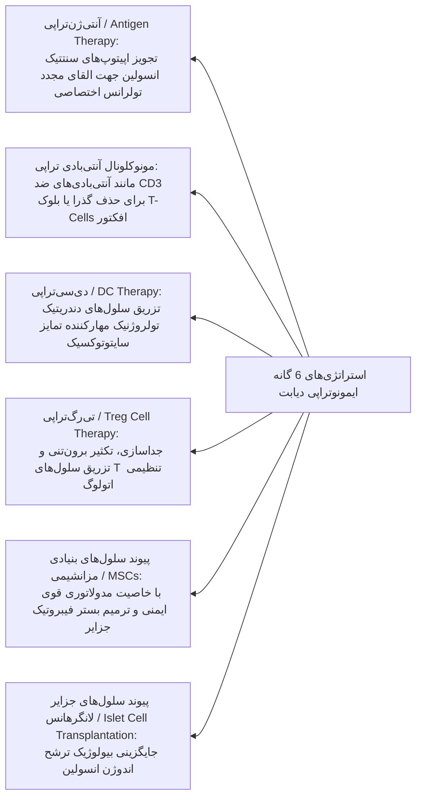

---

## 6. تیروئید و بیماری‌های اتوایمیون تیروئید (AITD)

> [!definition] بیماری‌های اتوایمیون تیروئید (Autoimmune Thyroid Diseases / AITD)
> طیفی از بیماری‌های اختصاصی ارگان که ناشی از شکست تولرانس در برابر تیروسیت‌ها و پروتئین‌های ساختاری تیروئید بوده و در دو قطب بالینی متضاد شامل **پرکاری اتوایمیون تیروئید (بیماری گریوز)** و **کم‌کاری اتوایمیون تیروئید (بیماری هاشیموتو)** تظاهر می‌یابند.

### ویژگی‌های همه‌گیرشناسی و اهمیت بالینی
* **شیوع:** شیوع کلی تا **5% جمعیت جهان** را در بر می‌گیرد و اینسیدنس آن روندی صعودی دارد.
* **توزیع نسبی:** شیوع بیماری **هاشیموتو به مراتب بالاتر از گریوز** است و به عنوان شایع‌ترین عامل کم‌کاری تیروئید در مناطق بدون فقر ید شناخته می‌شود.
* **پیامدهای ثانویه خطرناک کم‌کاری تیروئید:** مستعدسازی مستقیم فرد به **بیماری‌های آترواسکلروتیک قلبی-عروقی (Cardiovascular Diseases)** و نئوپلاسم‌ها/تومورها.

---

### ماتریس همراهی بالینی و پلی‌اندوکرینوپاتی (Comorbidities)

> [!important] مفهوم پلی‌اندوکرینوپاتی و سندروم همپوشانی (Overlap)
> ابتلای هم‌زمان یا توالی یک فرد مبتلا به تیروئیدیت به سایر بیماری‌های سیستمیک اتوایمیون بر اساس پایه‌های ژنتیکی مشترک و ارتشاح مشابه کلون‌های لنفوسیتی:

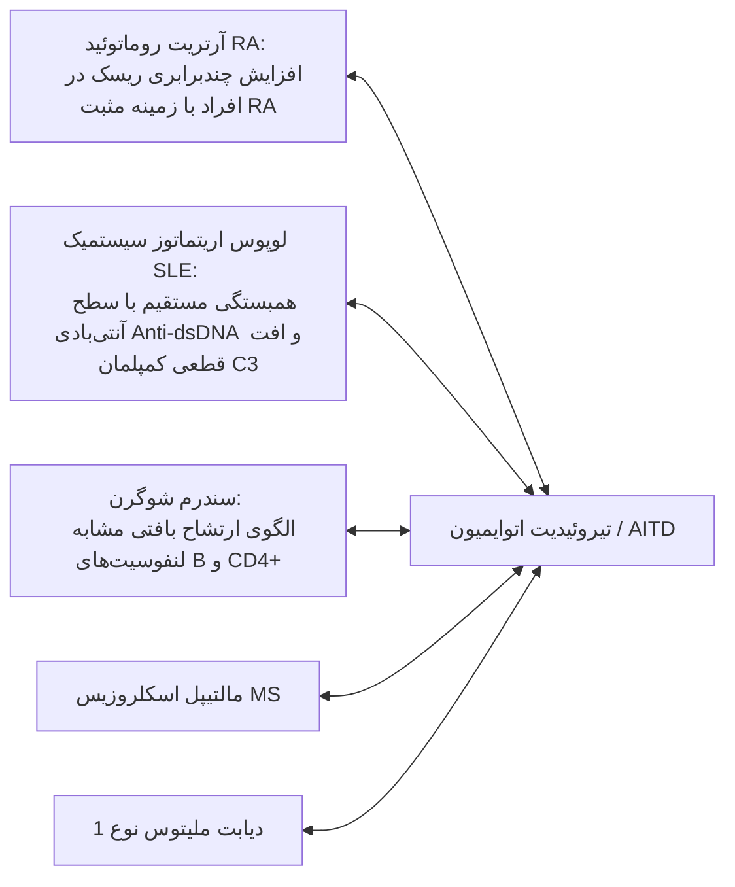

---

### ته‌نگاشت آنتی‌ژن‌های اختصاصی تیروئید

1. **تیروئید پراکسیداز (TPO / Thyroid Peroxidase):**
   * آنزیم کلیدی مستقر در غشای اپیکال سلول‌های فولیکولی تیروئید، مسئول اکسیداسیون ید و یداسیون تیروزین.
   * تارگت اتوآنتی‌بادی‌های سرمی سایتوتوکسیک و تخریب‌کننده بافتی.
2. **تیرولوبولین (Tg / Thyroglobulin):**
   * ماتریکس پیش‌ساز پروتئینی هورمون‌های تیروئیدی درون کلوئید فولیکول‌ها؛ تخریب آن منتهی به آزادسازی DAMPs می‌شود.
3. **گیرنده هورمون محرک تیروئید (TSH-Receptor / TSH-R):**
   * رسپتور جفت‌شده با پروتئین G بر سطح تیروسیت‌ها؛ تعیین‌کننده فنوتیپ بالینی بر اساس نوع آنتی‌بادی تولیدشده (*تحریکی یا مهاری*).

---

## 7. ایمونوپاتوژنز مقایسه‌ای: گریوز در برابر هاشیموتو

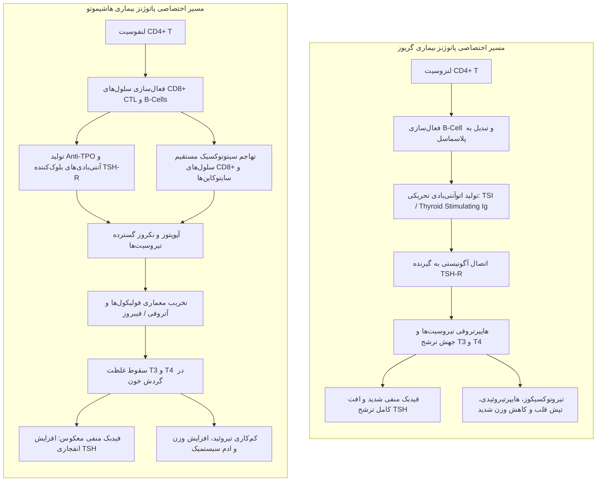

### مقایسه تطبیقی جامع: گریوز در برابر هاشیموتو

| مولفه ایمونولوژیک و بالینی | بیماری گریوز (Graves' Disease) | تیروئیدیت هاشیموتو (Hashimoto's) |
| :--- | :--- | :--- |
| **تعریف و تظاهر هورمونی** | هایپرتیروئیدیسم / پرکاری شدید تیروئید (تیروتوکسیکوز). | هایپوتیروئیدیسم / کم‌کاری مزمن تیروئید. |
| **اتوآنتی‌بادی شاخص پاتوژنیک** | ایمونوگلوبولین تحریک‌کننده تیروئید (**TSI / TSAb**) علیه *TSH-R*. | اتوآنتی‌بادی ضد تیروئید پراکسیداز (**Anti-TPO**) و ضد تیروگلوبولین (**Anti-Tg**). |
| **ماهیت عملکردی آنتی‌بادی** | **محرک و آگونیست (Activating/Stimulatory):** تقلید پیام TSH بدون نیاز به لیگاند. | **مسدودکننده (Blocking) و سایتوتوکسیک:** مهار اتصال TSH و القای آسیب بافتی. |
| **مکانیسم تخریب سلولی** | فاقد مرگ سلولی؛ هایپرپلازی و تحریک مفرط عملکردی سلول‌های بتا/فولیکولی. | تخریب وسیع با میانجیگری آپوپتوز، آنزیم‌های پرفورین/گرانزیم **CD8+ CTL** و فاگوسیتوز. |
| **وضعیت هورمون‌های در گردش** | جهش غلظت خونی **T3** و **T4** همراه با سرکوب شدید سطح **TSH**. | افت شدید غلظت خونی **T3** و **T4** همراه با افزایش جبرانی بارز **TSH**. |
| **مشخصه پاتولوژی بافتی** | هایپرپلازی اپیتلیوم فولیکولی با کلوئید کم‌رنگ و اسکالوپینگ حاشیه‌ای. | **ارتشاح متراکم لنفوسیتی** با تشکیل **فولیکول‌های لنفاوی ژرمینال سنتردار نابجا** و فیبروز. |
| **نمودهای بالینی متابولیک** | **کاهش وزن مفرط**، عدم تحمل گرما، تاکیکاردی، تحریک‌پذیری عصبی. | **افزایش وزن غیرمنتظره**، عدم تحمل سرما، برادی‌کاردی، خستگی مزمن. |
| **تظاهرات بالینی اختصاصی** | **افتالموپاتی گریوز** (اگزوفتالمی) و درموپاتی پره‌تیبیال (میکزدم). | گواتر اولیه با تخریب ثانویه بافت غده و ایجاد آتروفی پایانی. |

---

### عوارض بالینی و الگوهای اختصاصی بیماری گریوز

> [!important] مکانیسم افتالموپاتی گریوز (Graves' Ophthalmopathy)
> اتصال متقاطع اتوآنتی‌بادی‌های تحریک‌کننده گیرنده TSH به گیرنده‌های مشترک موجود بر سطح **فیبروبلاست‌ها و پره‌آدیپوسیت‌های رترواوربیتال چشم**؛ القای ترشح موکوپلی‌ساکاریدها و گلیکوزآمینوگلیکان‌ها، احتباس آب، هایپرتروفی شدید عضلات اکسترااکولار و بیرون‌زدگی کره چشم (*Exophthalmos*).

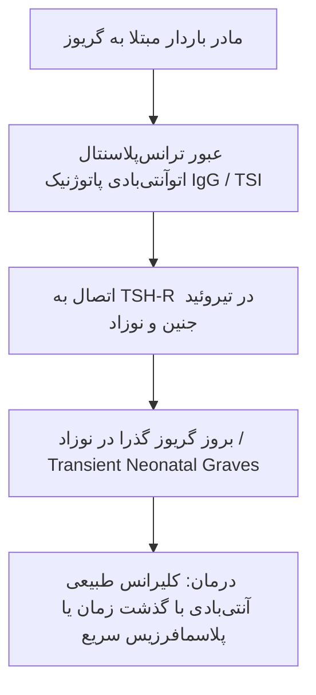

> [!danger] نکته امتحانی فوق‌العاده مهم: گریوز گذرای نوزادی (Transient Neonatal Graves)
> آنتی‌بادی‌های کلاس **IgG** علیه TSH-R (*برخلاف سلول‌های T اختصاصی*) به راحتی از **سد جفتی (Placenta)** عبور می‌کنند. نوزاد متولدشده از مادر مبتلا به گریوز دچار تیروتوکسیکوز حاد و گذرا می‌گردد. از آنجا که این وضعیت حاصل انتقال آنتی‌بادی پسیو بدون کلون‌های اتوراکتیو سلولی ماندگار است، بیماری با **پلاسمافرزیس (Plasmapheresis)** یا پاک‌سازی تدریجی آنتی‌بادی‌های مادری توسط کاتابولیسم فیزیولوژیک نوزاد کاملاً برطرف می‌شود.

---

## 8. الگوریتم تشخیصی و تصمیم‌گیری بالینی

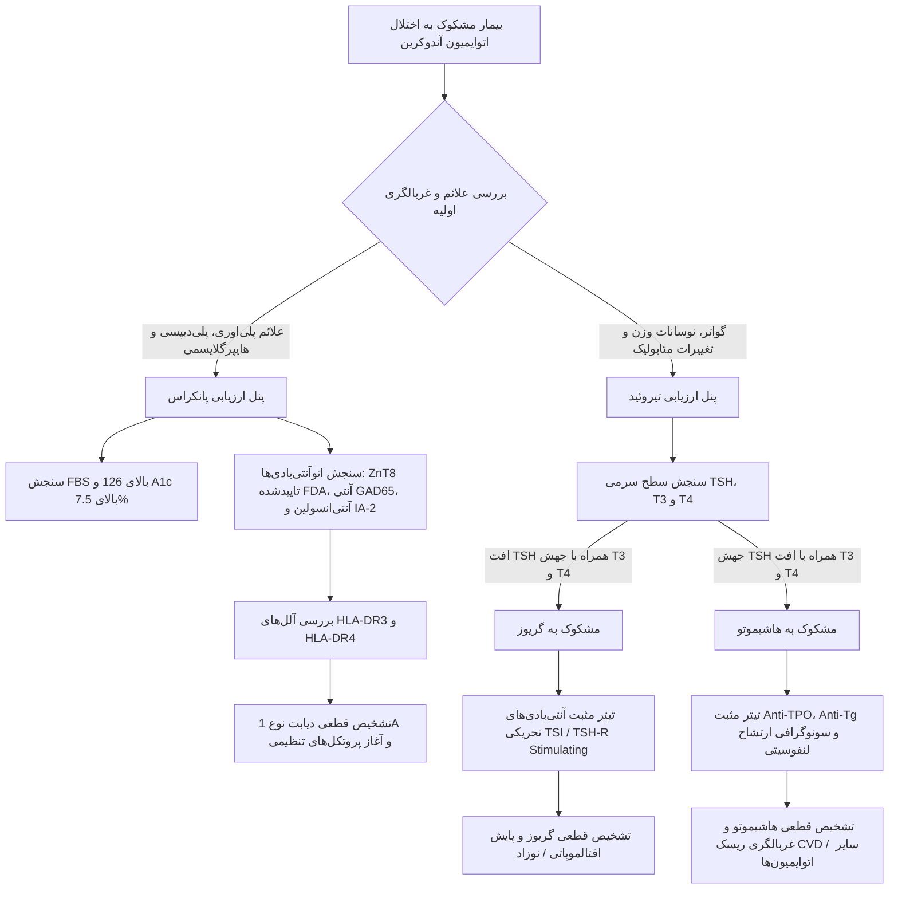

> [!note] جمع‌بندی نهایی
> تظاهرات اتوایمیونیتی غدد درون‌ریز از یک منطق سلولی مشترک تبعیت می‌کنند: آسیب‌پذیری ساختاری ناشی از آلل‌های سیستم ایمنی (*عمدتاً HLA کلاس II*) که تحت تاثیر اختلالات سد میکروبیوم، فاکتورهای تغذیه‌ای دوران شیرخوارگی یا عفونت‌های دارای شبیه‌سازی مولکولی به فاز تهاجم وارد می‌شوند. سرنوشت بافت هدف (*تخریب کامل آپوپتوتیک نظیر دیابت نوع 1 و هاشیموتو در برابر تحریک خودمختار نظیر گریوز*) کاملاً به نوع کلون‌های افکتور و ماهیت تحریکی یا مهاری آنتی‌بادی‌های سنتزشده وابسته است.

