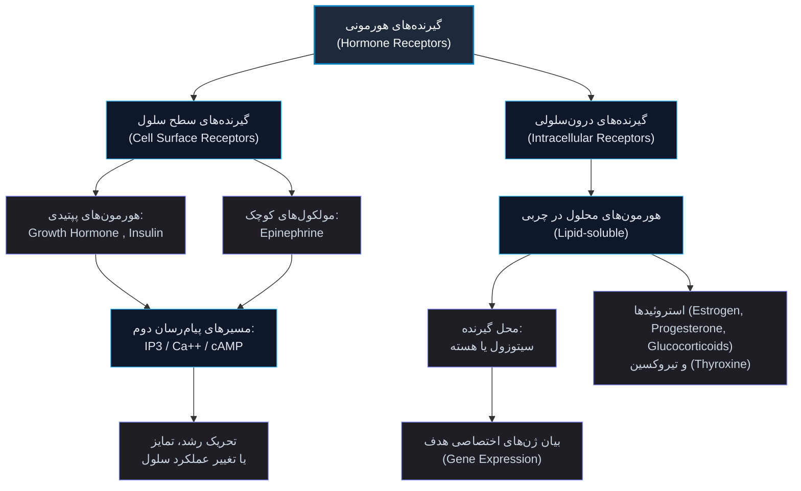
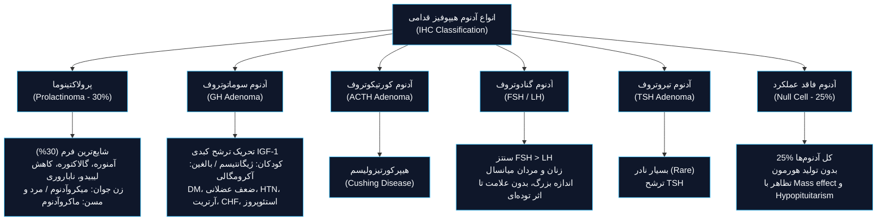
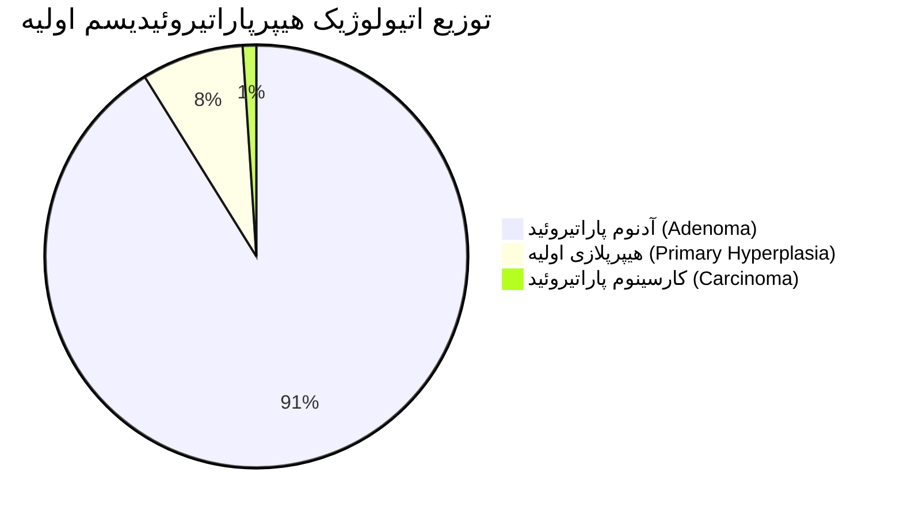
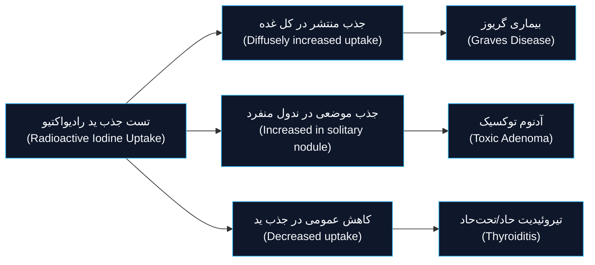
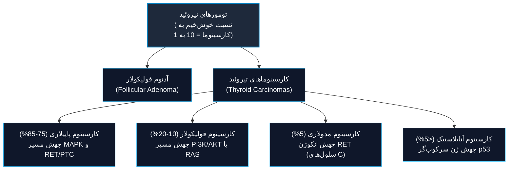

# پاتولوژی سیستم اندوکرین (Endocrine Pathology)

## بخش ۱: مبانی ترشح، گیرنده‌ها و مکانیسم‌های آسیب‌شناسی

### ۱.۱. انواع پیام‌رسانی برون‌سلولی مولکول‌های ترشحی (Signaling)
1. **پیام‌رسانی اتوکرین (Autocrine):** ترشح لیگاند و تاثیر بر گیرنده‌های *همان سلول ترشح‌کننده*.
2. **پیام‌رسانی پاراکرین (Paracrine):** انتشار لیگاند در ریزمحیط مجاور و اثر بر *سلول‌های هدف همجوار*.
3. **پیام‌رسانی اندوکرین (Endocrine):** ورود هورمون به جریان خون و هدایت به‌سوی *سلول‌های هدف دوردست*.

### ۱.۲. طبقه‌بندی بیوشیمیایی و پاتوفیزیولوژیک گیرنده‌های هورمونی (Hormone Receptors)

> [!definition] بیماری‌های درون‌ریز (Endocrine Diseases)
> اختلالات سیستم اندوکرین بر پایه اختلال در ۴ محور اصلی بالینی-آسیب‌شناسی طبقه‌بندی می‌شوند:
> 1. **کاهش تولید (Underproduction):** نقص ترشحی، آتروفی، تخریب خودایمنی، انفارکتوس یا نقص ژنتیکی سنترال/محیطی.
> 2. **افزایش تولید (Overproduction):** هیپرپلازی، آدنوم، کارسینوما یا ترشح نابه‌جا (*اکتوپیک*).
> 3. **مقاومت بافت هدف (End-organ resistance):** نقص عملکردی گیرنده‌های هورمونی یا مسیرهای پیام‌رسانی پایین‌دست علی‌رغم سطح نرمال یا بالای هورمون.
> 4. **اثر توده‌ای (Mass effect):** عوارض فشاری تومورها بر ساختارهای مجاور آناتومیک (همچون کیاسمای بینایی، استخوان اسفنوئید یا بافت پارانشیم نرمال).

---

## بخش ۲: غده هیپوفیز (Pituitary Gland)

### ۲.۱. مشخصات آناتومیک و مورفولوژیک پایه
* **ابعاد و شکل:** توده لوبیایی‌شکل کوچک (*Small bean-shaped*) به طول تقریبی **1 cm**.
* **وزن ارگان:** حدود **0.5 gm**.
* **لوب‌ها:**
  1. لوب قدامی (**Adenohypophysis**).
  2. لوب خلفی (**Neurohypophysis**).
* **تظاهرات بالینی بیماری‌های هیپوفیز:**
  * **هیپوپیتوئیتاریسم (Hypopituitarism)**
  * **هیپرپیتوئیتاریسم (Hyperpituitarism)**
  * **اثرات توده‌ای موضعی (Local mass effects)**

### ۲.۲. علل زمینه‌ای هیپرپیتوئیتاریسم (Hyperpituitarism Etiologies)
1. **آدنوم هیپوفیز (Adenoma):** شایع‌ترین علت (*most common*).
2. **هیپرپلازی هیپوفیز قدامی (Hyperplasia)**.
3. **کارسینوم هیپوفیز قدامی (Carcinoma)**.
4. **ترشح هورمون توسط نئوپلاسم‌های خارج هیپوفیزی (Extra-pituitary tumors)**.
5. **اختلالات مشخص هیپوتالاموسی (Certain hypothalamic disorders)**.

### ۲.۳. پاتولوژی آدنوم‌های هیپوفیز (Pituitary Adenomas)
* **اپیدمیولوژی:** بالغین سنین **30 تا 50 سال**؛ مسئول **10%** نئوپلاسم‌های اینتراکرانیال.
* **الگوی بروز:** عمدتاً ضایعات منفرد و ایزوله (*isolated*). صرفاً در حدود **5%** موارد با **MEN-1** همراهی دارند.
* **طبقه‌بندی بر اساس اندازه:**
  * **میکروآدنوم (Microadenoma):** قطر کمتر از **1 cm** ($<1\text{ cm}$).
  * **ماکروآدنوم (Macroadenoma):** قطر بیشتر از **1 cm** ($>1\text{ cm}$).
* **پاتوژنز و اختلالات مولکولی:**
  * جهش پروتئین‌های G (*G-protein mutations*): **شایع‌ترین رویداد مولکولی**.
  * آدنوم‌های فامیلیال: نقص ژن‌های **MEN1**، **CDKN1B**، **PRKAR1A** و **AIP**.
  * آدنوم تهاجمی (*Aggressive adenoma*): جهش و بیش‌بیان در **Cyclin D1**، **Rb** و **p53**.
  * کارسینوم هیپوفیز: جهش اختصاصی ژن **HRAS**.

> [!important] دو ویژگی بارز و اختصاصی در هیستومورفولوژی آدنوم‌های هیپوفیز
> تشخیص پاتولوژیک آدنوم هیپوفیز بر دو محور ساختاری قطعی استوار است:
> 1. **تک‌شکلی سلولی (Cellular monomorphism):** بر خلاف بافت متکثر طبیعی، سلول‌های نئوپلاستیک سلول‌های یکدست پلیکونال در ورقه‌ها (*sheets*) یا طناب‌ها (*cords*) هستند.
> 2. **فقدان شبکه رتیکولین (Absence of a reticulin network):** شبکه ظریف رتیکولین که پارانشیم نرمال لوله‌ها را در بر می‌گیرد، در آدنوم کاملاً تخریب و مفقود می‌شود.

* **ویژگی‌های مورفولوژیک عمومی:**
  * ماکروسکوپی: ضایعه نرم، با حدود مشخص؛ **30% موارد فاقد کپسول** و با ارتشاح به بافت مجاور. ممکن است در زین ترکی (*Sella turcica*) محصور بماند یا به بالا گسترش یافته و کیاسمای بینایی و اعصاب مغزی را تحت فشار قرار دهد.
  * ضایعات بزرگتر مستعد نکروز و خونریزی موضعی (*Foci of hemorrhage and necrosis*) هستند.
  * سیتولوژی: سلول‌های پلی‌گونال یکدست؛ هسته‌ها یکنواخت یا پلئومورفیک؛ فعالیت میتوزی معمولاً ناچیز (*scanty*).
  * رنگ‌پذیری سیتوپلاسم: اسیدوفیلیک، بازوفیلیک یا کروموفوبیک.
  * **آدنوم آتیپیک (Atypical adenoma):** افزایش مارکر **p53+** همگام با شمار بالای میتوز (*high mitotic figures*).

> [!tip] تشخیص افتراقی هیپرپرولاکتینمی ناشی از آدنوم و علل غیرتوموری
> افزایش پرولاکتین صرفاً منحصر به پرولاکتینوما نیست؛ علل فیزیولوژیک، فارماکولوژیک و تروماتیک زیر همواره در تشخیص افتراقی مطرح‌اند:
> * **فیزیولوژیک و واکنشی:** بارداری (*Pregnancy*)، تحریک نوک پستان (*Nipple stimulation*) و پاسخ به انواع استرس‌ها (*Stress*).
> * **دارویی:** داروهای آنتاگونیست و مهارکننده دوپامین (*Dopamine inhibitory drugs*).
> * **اندوکرین و متابولیک:** استروژن‌ها، هیپوتیروئیدی سنترال/پریفرال و نارسایی مزمن کلیه (*Renal failure*).
> * **مکانیکی:** سندروم اثر ساقه (*Stalk effect*) از طریق مهار انتقال دوپامین هیپوتالاموسی به ادنوهیپوفیز ناشی از فشار ماکروآدنوم‌ها.

### ۲.۴. هیپوپیتوئیتاریسم و سندرم‌های ایسکمیک
> [!definition] آستانه پاتولوژیک هیپوپیتوئیتاریسم (Critical Threshold)
> نارسایی ترشحی بالینی هیپوفیز قدامی زمانی بروز می‌کند که **حداقل 75%** از پارانشیم ترشحی هیپوفیز تخریب، مفقود یا فاقد کارایی شده باشد (*approximately 75% of the parenchyma is lost or absent*).

* **علل هیپوپیتوئیتاریسم:**
  1. آدنوم هیپوفیز (با اثر فشاری بر پارانشیم نرمال مجاور).
  2. آپوپلکسی هیپوفیز (*Pituitary apoplexy*): **خونریزی حاد و ناگهانی** درون غده هیپوفیز.
  3. نکروز ایسکمیک: **سندرم شیهان (Sheehan syndrome)** یا نکروز پس از زایمان هیپوفیز قدامی.
  4. اعمال جراحی هیپوفیز و رادیاسیون.
  5. بیماری‌های التهابی، تروما و ضایعات متاستاتیک به هیپوفیز.
* **تظاهرات بالینی بر اساس کمبود رده‌های سلولی:**
  * کمبود **GH**: توقف رشد و کوتاهی قد ناشی از هیپوفیز (*Pituitary dwarfism*) در اطفال.
  * کمبود گنادوتروپین‌ها (**GnRH/LH/FSH**): در زنان: آمنوره و ناباروری؛ در مردان: کاهش میل جنسی، ایمپوتنس و ریزش موهای عانه و زیربغل (*loss of pubic and axillary hair*).
  * کمبود **TSH** و **ACTH**: بروز بالینی هیپوتیروئیدی و هیپوآدرنالیسم ثانویه.
  * کمبود پرولاکتین (**Prolactin**): ناتوانی و عدم امکان شیردهی پس از زایمان (*lack of postpartum lactation*).
  * کمبود **MSH**: رنگ‌پریدگی پوستی (*pallor*).

> [!important] قاعده طلایی هیپوپیتوئیتاریسم و دیابت بی‌مزه
> هیپوپیتوئیتاریسمی که همراه با شواهد نارسایی عملکردی هیپوفیز خلفی به فرم **دیابت بی‌مزه (Diabetes Insipidus)** باشد، **تقریباً همواره منشأ هیپوتالاموسی دارد** (*almost always of hypothalamic origin*).

> [!example] بررسی بالینی امتحانی: کیس ریپورت شماره ۱ (Sheehan Syndrome)
> **شرح مورد:** خانم ۳۱ ساله که در منزل دچار کاهش هوشیاری (*unresponsive*) شده است.
> * **علائم حیاتی:** بدون تب؛ نبض: $50\text{ /min}$ (برادی‌کاردی)؛ تنفس: $12\text{ /min}$؛ فشار خون: $100/60\text{ mmHg}$.
> * **آزمایشات اورژانس:** سدیم: $134\text{ mmol/L}$؛ پتاسیم: $4.0\text{ mmol/L}$؛ کلر: $110\text{ mmol/L}$؛ گلوکز خون: **$40\text{ mg/dL}$** (هیپوگلیسمی شدید).
> * **شرح حال اختصاصی:** ۴ ماه قبل زایمان فرزند دوم داشته است؛ از زمان زایمان دچار خستگی مفرط (*fatigue*)، سستی، کسالت (*malaise*) و ضعف شدید بوده که به اشتباه به افسردگی پس از زایمان (*postpartum depression*) نسبت داده شده بود. همچنین سابقه دوره‌های استفراغ، درد شکمی و اسهال دارد؛ بدون سابقه مصرف الکل/دارو، عدم ابتلا به دیابت و تا پیش از زایمان در سلامت و فعالیت بدنی کامل بوده است.
> * **پاتوفیزیولوژی:** نکروز ایسکمیک پس از زایمان غده هیپوفیز قدامی ناشی از هیپوتانسیون/خونریزی زایمان (**Sheehan Syndrome**) که منتهی به هیپوپیتوئیتاریسم کامل، کمبود ثانویه کورتیزول و تیروئید، و بروز حمله نهایی با برادی‌کاردی و هیپوگلیسمی شدید شده است.

### ۲.۵. سندرم‌های هیپوفیز خلفی (Posterior Pituitary Syndromes)
نورون‌های ترشحی هسته‌های هیپوتالاموس دو پپتید تولید و در هیپوفیز خلفی ذخیره می‌کنند: **واسوپرسین یا ADH** و **اکسی‌توسین (Oxytocin)**.
1. **دیابت بی‌مزه (Diabetes Insipidus):**
   * اتیولوژی: کمبود مطلق سنتز هورمون (**Central DI**) یا عدم پاسخ‌دهی لوله‌های کلیوی به سطح نرمال آن (**Nephrogenic DI**).
   * نشانه‌ها: دفع حجم بالای ادرار رقیق (*polyuria*)، افزایش غلظت سدیم و اسکولاریته سرم (*↑ serum sodium & osmolality*)، تشنگی شدید و پلی‌دیپسی (*polydipsia*).
2. **سندرم ترشح نامتناسب هورمون ضدادراری (SIADH):** احتباس پاتولوژیک آب آزاد، هیپوناترمی رقیق‌شدگی، ادم و افزایش اسمولاریته ادرار.

---

## بخش ۳: غدد پاراتیروئید (Parathyroid Glands)

### ۳.۱. آناتومی، رویان‌شناسی و بافت‌شناسی
* **منشأ جنینی:** تکامل‌یافته از **کیسه‌های حلقی (Pharyngeal pouches)** سوم و چهارم (هم‌منشأ با تکامل بافت *تیموس*).
* **شمارش و مشخصات فیزیکی:** **۴ عدد غده**؛ گره‌های بیضی‌شکل کپسول‌دار به رنگ زرد متمایل به قهوه‌ای (*yellow-brown*).
* **جمعیت‌های سلولی پارانشیم:**
  1. **سلول‌های اصلی (Chief cells):** سازنده و ترشح‌کننده **PTH** (سلول‌های غالب بافت).
  2. **سلول‌های اکسی‌فیل (Oxyphil cells):** سیتوپلاسم وسیع ائوزینوفیلیک مملو از میتوکندری؛ فاقد ترشح بارز پاراتورمون.
* **تنظیم ترشح:** ترشح هورمون پاراتیروئید مستقیماً توسط **سطح کلسیم آزاد (یونیزه)** سرم پایش و فیدبک منفی می‌شود (*controlled by ionized calcium*).

### ۳.۲. هیپرپاراتیروئیدیسم اولیه (Primary Hyperparathyroidism)
یکی از شایع‌ترین اختلالات اندوکرین و مهم‌ترین علت بروز **هیپرکلسمی** بدون علامت در بالین.

| صفت پاتولوژیک | آدنوم پاراتیروئید (Adenoma) | هیپرپلازی پاراتیروئید (Hyperplasia) | کارسینوم پاراتیروئید (Carcinoma) |
| :--- | :--- | :--- | :--- |
| **درگیری غدد** | تقریباً همواره **منفرد (Solitary)**؛ تک‌غده‌ای | **هر ۴ غده** درگیرند (کلاسیک) | عمدتاً **تک‌غده‌ای (Single gland)** |
| **وزن کل بافت** | متوسط بین **0.5 تا 5.0 گرم** | مجموع وزن هر ۴ غده **کمتر از 1.0 گرم** | توده بزرگ؛ گاه **بالای 10 گرم** |
| **نمای ظاهری** | ندول با حدود مشخص، نرم، برنزه مایل به قهوه‌ای، کپسول‌دار | بزرگ‌شدگی منتشر یا ندولار هر ۴ غده | توده سفید، نامنظم و متراکم (*irregular*) |
| **وضعیت سایر غدد** | غدد دیگر نرمال یا آتروفیک/کوچک‌شده (*shrunk*) | تمامی غدد دستخوش هیپرتروفی/هیپرپلازی | غدد دیگر معمولاً دست‌نخورده یا آتروفیک |
| **مشخصات بافتی** | عمدتاً سلول اصلی؛ آندوکراین آتیپی؛ میتوز نادر | هیپرپلازی سلول اصلی؛ بافت چربی استروما ناپدید؛ فرم سلول شفاف آبکی (*water-clear*) | ساختار یکنواخت؛ آتیپی شدید سیتولوژی |
| **ژنتیک شایع** | وارونگی **Cyclin D1** (در 10-40%)؛ جهش **MEN1** (در 20-30%) | همراه با سندروم‌های نئوپلازی متعدد اندوکرین | همراهی با جهش‌های ژن سرکوب‌گر تومور |
| **معیار بدخیمی** | خوش‌خیم؛ عدم تهاجم | تغییر واکنشی یا ژنتیکی خوش‌خیم | **تهاجم به بافت مجاور و متاستاز** (تنها معیار) |

> [!important] ضوابط طلایی پاتولوژی برای کارسینوم پاراتیروئید
> وجود آتیپی سلولی یا پلئومورفیسم هسته‌ای به‌تنهایی دال بر بدخیمی نیست (**Endocrine atypia** در آدنوم شایع است). بر مبنای اسلایدهای مرجع، **تهاجم به بافت‌های احاطه‌کننده (Invasion of surrounding tissues) و متاستاز قطعی (Metastasis)**، تنها معیارهای قابل اعتماد برای تأیید بدخیمی کارسینوم پاراتیروئید محسوب می‌شوند.

### ۳.۳. تغییرات مورفولوژیک سیستمیک در سایر ارگان‌ها متعاقب هیپرکلسمی
1. **تغییرات اسکلتی:** استئوپنی، استئیت فیبروزا سیستیکا (*Osteitis fibrosa cystica*)؛ ایجاد تومور قهوه‌ای (**Brown tumor**) ناشی از تجمع متراکم استئوکلاست‌ها در نواحی بازجذب استخوان و خونریزی.
2. **اختلالات سیستم عصبی مرکزی (CNS):** افسردگی شدید (*depression*)، بی‌حالی و لتارژی (*lethargy*)، و حملات تشنج (*seizures*).
3. **ناهنجاری‌های نوروماسکولار:** ضعف پیشرونده و هیپوتونی عضلانی (*hypotonia*).
4. **عوارض کلیوی:** پلی‌اوری ناشی از مهار عملکرد لوله‌ها، پلی‌دیپسی ثانویه، تشکیل سنگ‌های ادراری (**نفرولیتیازیس**) و رسوب کلسیم در پارانشیم کلیه (**نفرونکلسینوزیس**).
5. **کلسیفیکاسیون متاستاتیک (Metastatic calcification):** رسوب کلسیم ثانویه به هیپرکلسمی در ریه، معده و دیواره عروق.
6. **اختلالات دستگاه گوارش (GI):** زخم پپتیک (*peptic ulcer*)، سنگ کیسه صفرا (*gall stone*) و پانکراتیت حاد (*pancreatitis*).

> [!tip] تمایز بیوشیمیایی و بالینی هیپرکلسمی ناشی از آدنوم در برابر بدخیمی‌ها
> * **هیپرکلسمی پنهان/خاموش (Silent / Asymptomatic):** ویژگی هیپرپاراتیروئیدیسم اولیه؛ تست‌های آزمایشگاهی نشان‌دهنده **افزایش نامتناسب و نابجای PTH تام سرم** به موازات بالا بودن کلسیم است.
> * **هیپرکلسمی علامت‌دار (Symptomatic):** ناشی از سندروم پارانئوپلاستیک ترشح کننده $PTHrP$ یا متاستاز استئولیتیک وسیع استخوانی در سرطان‌های پیشرفته. در این موارد **سطح پاراتورمون طبیعی سرم (PTH) سرکوب شده، پایین یا غیرقابل اندازه‌گیری (low to undetectable)** است و پیش‌آگهی بیمار بسیار ضعیف است.

### ۳.۴. هیپرپاراتیروئیدیسم ثانویه و ثالثیه
* **پاتوفیزیولوژی ثانویه:** پاسخ تحریکی جبرانی و ترشح بیش‌ازحد PTH در واکنش به **کاهش مزمن غلظت کلسیم یونیزه سرم**.
* **اتیولوژی‌های هیپرپاراتیروئیدیسم ثانویه:**
  1. **نارسایی مزمن کلیه (Renal failure):** شایع‌ترین علت ثانویه (*most common cause*).
  2. دریافت ناکافی کلسیم در رژیم غذایی (*Inadequate dietary intake of calcium*).
  3. استئاتوره و سوءجذب چربی‌ها (*Steatorrhea*).
  4. کمبود ویتامین د (**Vitamin D deficiency**).
* **هیپرپاراتیروئیدیسم ثالثیه (Tertiary):** تبدیل افزایش ترشح جبرانی پاراتیروئید به فعالیت خودمختار، خودبه‌خودی و کنترل‌نشده غدد (Autonomous) متعاقب هیپرپلازی ثانویه طولانی‌مدت.

### ۳.۵. هیپوپاراتیروئیدیسم (Hypoparathyroidism)
* **علل زمینه‌ای:**
  1. القای جراحی (*Surgically induced*): **برداشتن یا ترومای اتفاقی** به عروق پاراتیروئید حین تیروئیدکتومی (شایع‌ترین علت بالینی).
  2. عدم تشکیل مادرزادی تمامی غدد: **سندروم دی‌جرج (DiGeorge syndrome)** در همراهی با آپلازی تیموس و نقص قلبی.
  3. هیپوپاراتیروئیدیسم خودایمنی: فامیلیال و ارثی ناشی از جهش در ژن تنظیم‌کننده ایمنی **AIRE**.
* **تظاهرات بالینی ناشی از هیپوکلسمی:**
  * **افزایش تحریک‌پذیری عصبی-عضلانی:** سوزن‌سوزن شدن انتهای اندام‌ها (*tingling*)، اسپاسم عضلانی، اسپاسم کارپوپدال (*carpopedal spasm*) و **تتانی (Tetany)**.
  * آریتمی‌های قلبی، تشنج و افزایش فشار داخل جمجمه ($↑\text{ ICP}$).
  * تغییرات مزمن: بروز کاتاراکت، کلسیفیکاسیون گانگلیون‌های پایه‌ای مغز (*calcification of cerebral basal ganglia*) و نقایص ساختاری دندان‌ها.

---

## بخش ۴: غده تیروئید (Thyroid Gland)

### ۴.۱. آناتومی و فیزیولوژی عملکردی
* **ساختار فیزیکی:** متشکل از **دو لوب طرفی و یک ایسموس (Isthmus)**؛ وزن نرمال بین **10 تا 25 گرم**.
* **واحدهای ساختاری:** هر لوب واجد **20 تا 40 فولیکول** با توزیع یکنواخت است.
* **رده‌های سلولی پارانشیم تیروئید:**
  1. **سلول‌های فولیکولی (Follicular cells):** تبدیل تیروگلوبولین به تیروکسین ($T_4$) و تری‌یدوتیرونین ($T_3$).
  2. **سلول‌های پارافولیکولار یا سلول‌های C:** سنتز و ترشح هورمون **کلسی‌تونین (Calcitonin)**.

### ۴.۲. تیروتوکسیکوز و هیپرتیروئیدی (Hyperthyroidism & Thyrotoxicosis)
> [!definition] تمایز مفهومی تیروتوکسیکوز و هیپرتیروئیدی
> * **تیروتوکسیکوز (Thyrotoxicosis):** سندرم بالینی و وضعیت فوق‌متابولیک ناشی از افزایش سطح بافتی هورمون‌های آزاد $fT_3$ و $fT_4$، صرف نظر از منبع منشأ (تولید مازاد غده، تخریب فولیکول‌ها و خروج هورمون ذخیره‌شده، یا منبع برون‌زای اکستراتیروئیدی).
> * **هیپرتیروئیدی (Hyperthyroidism):** زیرمجموعه‌ای اختصاصی از تیروتوکسیکوز که صرفاً بر اثر سنتز و ترشح بیش از حد هورمون تیروئید توسط خود غده ایجاد می‌شود.
> * **علت غالب:** هیپرپلازی منتشر ناشی از **بیماری گریوز (Graves disease)** مسئول **85% کل موارد** است.

* **تظاهرات بالینی و دوره‌های سیستمیک:**
  * افزایش متابولیسم پایه ($↑\text{ BMR}$)، پوست نرم، گرم و برافروخته (*warm and flushed skin*)، عدم تحمل گرما (*heat intolerance*) و افزایش تعریق.
  * کاهش وزن بارز علیرغم افزایش اشتها.
  * عوارض قلبی: تاکی‌کاردی، تپش قلب (*palpitations*)، کاردیومگالی، آریتمی‌ها (بویژه **فیبریلاسیون دهلیزی - Atrial fibrillation**) و نارسایی احتقانی قلب.
  * ناهنجاری عصبی عضلانی: میوپاتی تیروئیدی (*Thyroid myopathy*) در **50% بیماران**.
  * تغییرات چشمی: ناشی از تحریک بیش‌ازحد سمپاتیک بر عضله تارسوس فوقانی (*Superior tarsal muscle*)؛ **افتالموپاتی تمام‌عیار به همراه اگزوفتالمی و پروپتوزیس صرفاً در بیماری گریوز مشاهده می‌شود**.
* **اشکال خاص بالینی:**
  * **طوفان تیروئیدی (Thyroid storm):** شروع ناگهانی و انفجاری هیپرتیروئیدی شدید متعاقب جراحی، عفونت، یا قطع ناگهانی داروهای ضد تیروئید؛ یک **اورژانس قطعی پزشکی**.
  * **هیپرتیروئیدی آپاتتیک (Apathetic hyperthyroidism):** تیروتوکسیکوز در افراد سالمند با تظاهر غیراختصاصی کاهش وزن بدون توجیه یا تشدید نارسایی پیش‌رونده قلبی.

> [!important] مارکرهای آزمایشگاهی اختصاصی اختلالات عملکردی تیروئید
> * هیپرتیروئیدی اولیه: افت چشمگیر غلظت **$TSH\downarrow$** همراه با افزایش $T_4$ آزاد و تام ($FT_4\uparrow, T_4\uparrow$). در اختلالات ناشی از هیپوفیز یا هیپوتالاموس، غلظت TSH نرمال یا حتی بالا است. در تیروتوکسیکوز نوع $T_3$، غلظت $FT_3$ افزایش می‌یابد.
> * ارزیابی اولیه هیپوتیروئیدی: سنجش سطح **TSH سرم حساس‌ترین تست غربالگری اولیه** محسوب می‌شود.

---

### ۴.۳. هیپوتیروئیدی (Hypothyroidism)
ناشی از هرگونه نقص ساختاری یا عملکردی که مانع ترشح مقادیر کافی هورمون‌های تیروئید گردد.

* **تقسیم‌بندی و اتیولوژی‌های هیپوتیروئیدی اولیه (Primary Hypothyroidism):**
  1. **نقایص ژنتیکی (دیس‌ژنز تیروئید یا گواتر دیس‌هورمونوژنتیک):** شایع‌ترین علت هیپوتیروئیدی مادرزادی در ایالات متحده آمریکا.
  2. **کمبود اندمیک ید در رژیم غذایی:** شایع‌ترین علت هیپوتیروئیدی نوزادان و کودکان در مقیاس جهانی.
  3. **تیروئیدیت خودایمنی (Hashimoto thyroiditis):** شایع‌ترین علت در مناطقی از جهان که کمبود ید با نمک یددار تصحیح شده است.
  4. **هیپوتیروئیدی ناشی از درمان (Iatrogenic):** تخریب پارانشیم از طریق تیروئیدکتومی، پرتودرمانی یا عوارض ناخواسته دارویی.
* **اشکال بالینی سنی:**
  * **کرتینیسم (Cretinism):** در شیرخوارگی یا اوایل کودکی؛ شدت اختلال تکاملی مغز ارتباط مستقیم با *زمان بروز کمبود هورمون در دوره داخل رحمی* دارد.
  * **میکزدم (Myxedema):** فرم بالینی در کودکان بزرگتر و بالغین با علائم پوستی خمیری، پف‌آلودگی و کندی عمومی روان-حرکتی.

> [!example] بررسی بالینی امتحانی: کیس ریپورت شماره ۲ (Myxedema / Hypothyroidism)
> **شرح مورد:** خانم ۴۳ ساله با سابقه ۳ ساله لتارژی و ضعف فزاینده، عدم تحمل سرما (پوشیدن ژاکت در تابستان)، سابقه منوراژی در سال گذشته که اکنون تبدیل به اولیگومنوره شده است؛ ضعف تمرکز و حافظه، و یبوست مزمن.
> * **معاینه فیزیکی:** دمای بدن: $35.5^\circ\text{C}$ (هیپوترمی)؛ نبض: $54\text{ /min}$ (برادی‌کاردی)؛ تنفس: $13\text{ /min}$؛ فشار خون: $110/70\text{ mmHg}$. آلوپسی، پوست خشن و خشک؛ صورت، دست‌ها و پاها پف‌آلود با پوست خمیری‌شکل (*doughlike skin*).
> * **نتایج آزمایشگاهی:** $Hb=13.8\text{ g/dL}$؛ $Hct=41.5\%$؛ $Glucose=73\text{ mg/dL}$؛ $Creatinine=1.1\text{ mg/dL}$.
> * **تشخیص قطعی:** هیپوتیروئیدی اولیه شدید بالغین (**Myxedema**).

---

### ۴.۴. انواع تیروئیدیت (Thyroiditis)

| نوع تیروئیدیت | ویژگی‌های اپیدمیولوژیک و پاتوژنز | هیستوپاتولوژی اختصاصی | تظاهرات و همراهی‌های کلینیکی |
| :--- | :--- | :--- | :--- |
| **تیروئیدیت هاشیموتو (Hashimoto)** | شایع‌ترین فرم در مناطق غنی از ید؛ سن ۴۵ تا ۶۵ سال؛ غلبه بارز جنس مؤنث ($10:1$ تا $20:1$)؛ ژنتیک: **HLA-DR3** و **HLA-DR5** و پلی‌مورفیسم **CTLA4** | ارتشاح وسیع لنفوسیت‌های کوچک و پلاسماسل، تشکیل **مراکز زایگر تکامل‌یافته (Germinal centers)** و دگرگونی متالستیک سلول‌ها به **سلول هورتل (Hürthle cell)** | تخریب خودایمنی تدریجی؛ استعداد ابتلا به سایر بیماری‌های خودایمنی، خطر بالای **لنفوم غیرهوچکین سلول B** و زمینه ابتلا به کارسینوم پاپیلاری |
| **تیروئیدیت تحت‌حاد گرانولوماتوز (de Quervain)** | شیوع کمتر از هاشیموتو؛ بروز متعاقب **سابقه عفونت ویروسی دستگاه تنفس فوقانی (URI)** | واکنس گرانولوماتوز همراه با **سلول‌های غول‌پیکر چند‌هسته‌ای (Giant cells)**، تخریب فولیکول‌ها و ارتشاح التهابی | غده بزرگ‌شده، سفت و قرینه یا یک‌طرفه با کپسول سالم؛ تظاهر با **درد شدید گردن** همراه با تب، کوفتگی و خستگی مفرط |
| **تیروئیدیت لنفوسیتیک تحت‌حاد (Painless / Postpartum)** | انواعی از بیماری‌های تیروئیدی با زمینه خودایمنی؛ فرم شایع بی‌درد یا تظاهر پس از زایمان (*Postpartum*) | ارتشاح لنفوسیتی فاقد مراکز زایگر پیشرفته و بدون سلول هورتل | تیروئیدیت بدون درد؛ تغییرات دوره‌ای تیروتوکسیکوز گذرا و سپس هیپوتیروئیدی |
| **تیروئیدیت ریدل (Riedel Thyroiditis)** | اختلال بسیار نادر فیبروزان | بافت فیبروز وسیع و متراکم با تخریب بافت تیروئید | فیبروز سنگین درگیرکننده پارانشیم تیروئید و پیشروی به بافت‌های مجاور گردن |

---

### ۴.۵. بیماری گریوز (Graves Disease)
شایع‌ترین علت تیروتوکسیکوز و هیپرتیروئیدی درون‌زاد (*endogenous*).

* **تریاد علائم کلاسیک:**
  1. **هیپرتیروئیدی (Hyperthyroidism)** به واسطه هیپرپلازی منتشر غده.
  2. **افتالموپاتی ارتشاحی (Infiltrative ophthalmopathy)** با نتیجه بروز اگزوفتالمی و پروپتوز.
  3. **درموپاتی ارتشاحی موضعی (Localized infiltrative dermopathy):** معروف به **میکزدم پیش‌ساق‌پایی (Pretibial myxedema)**.
* **اپیدمیولوژی و ایمنوژنتیک:** پیک سنی بین **20 تا 40 سال**؛ غلبه در زنان ($F>M$)؛ همراهی با آلل‌های **HLA-DR3** و ژن‌های سرکوب‌گر ایمنی **CTLA4** و **PTPN22**.
* **اتوآنتی‌بادی‌های دخیل:**
  * **TSI (Thyroid-stimulating immunoglobulin):** اتوآنتی‌بادی محرک گیرنده TSH؛ محرک اصلی هیپرپلازی.
  * **Thyroid growth-stimulating immunoglobulin:** محرک تکثیر سلول‌های تیروئید.
  * **TSH-binding inhibitor immunoglobulin (TBII):** مانع اتصال هورمون که در مواردی می‌تواند منتهی به هیپوتیروئیدی اپیزودیک گردد.
* **پاتولوژی گریوز:**
  * **نمای ظاهری (Gross):** بزرگ‌شدگی متقارن و یکدست غده؛ سطح مقطع نرم، گوشتی و قرمز شبیه به عضله طبیعی (*meaty appearance resembling normal muscle*).
  * **هیستولوژی:** سلول‌های اپیتلیال فولیکولی بلند، استوانه‌ای و متراکم (*tall & crowded columnar cells*)؛ کلوئید داخل فولیکول‌ها کمرنگ و دارای **حاشیه‌های مضرس یا اسکالوپ (Scalloped margins)**؛ حضور ارتشاح لنفوئیدی و مراکز زایگر در بافت بینابینی.
  * **مکانیسم افتالموپاتی:** ادم شدید بافت‌های اربیت ناشی از رسوب گلیکوزآمینوگلیکان‌ها (**GAG**) و موکوپلی‌ساکاریدهای آب‌دوست (*hydrophilic mucopolysaccharides*).

> [!example] بررسی بالینی امتحانی: کیس ریپورت شماره ۳ (Graves Disease)
> **شرح مورد:** خانم ۲۱ ساله با شکایت ضعف فزاینده، خستگی، و **کاهش وزن ۷ کیلوگرمی طی ۴ ماه بدون داشتن رژیم غذایی**، اضطراب و عصبی‌بودن فزاینده به همراه اسهال مداوم.
> * **معاینه بالینی:** دمای بدن: $37.5^\circ\text{C}$؛ نبض: $103\text{ /min}$ (تاکی‌کاردی)؛ تنفس: $28\text{ /min}$؛ فشار خون: $140/75\text{ mmHg}$؛ بزرگ‌شدگی متقارن و منتشر غده تیروئید در لمس گردن.
> * **اسکن رادیونوکلئید تیروئید:** افزایش یکنواخت و منتشر در برداشت ماده رادیواکتیو در سراسر غده (*diffuse increase in uptake*).
> * **تشخیص پاتوفیزیولوژیک:** بیماری گریوز (**Graves Disease**).

---

### ۴.۶. گواتر ساده، منتشر و مولتی‌ندولار (Goiter)
* **پاتوژنز مشترک:** ناشی از کمبود اولیه ید در رژیم غذایی $\leftarrow$ اختلال در سنتز هورمون‌های تیروئید $\leftarrow$ افزایش جبرانی ترشح $TSH$ از هیپوفیز $\leftarrow$ هیپرپلازی و هیپرتروفی اپیتلیوم فولیکولی $\leftarrow$ دستیابی به وضعیت پایدار یوتیروئید (**Euthyroid**).
* **تقسیم‌بندی بالینی گواتر:**
  * **گواتر اندمیک (Endemic):** درگیری **بیش از 10% جمعیت** یک منطقه جغرافیایی به علت فقر خاکی/غذایی ید.
  * **گواتر اسپورادیک (Sporadic):** ناشی از گواتر دیس‌هورمونوژنتیک یا مصرف مواد گواتروژن و مداخله‌گر در سنتز ید.
* **دو فاز تحولی در گواتر منتشر غیرسمی (Diffuse nontoxic goiter):**
  1. **فاز هیپرپلاستیک (Hyperplastic phase):** غده بزرگ، متقارن و منتشر؛ سلول‌های استوانه‌ای متراکم با تشکیل برآمدگی‌های پاپیلاری پاتولوژیک داخل مجرا.
  2. **فاز پس‌رفت کلوئیدی (Colloid involution phase / Colloid goiter):** پس‌رفت اپیتلیوم فولیکولی و تجمع توده‌ای کلوئید فراوان درون حفرات اتساع‌یافته.
* **مورفولوژی گواتر مولتی‌ندولار (Multinodular Goiter):**
  * **ماکروسکوپی:** بزرگ‌شدگی فوق‌العاده شدید، غیریکدست و نامتقارن؛ **وزن توده ممکن است از 2000 گرم فراتر رود ($>2000\text{ gm}$)**؛ سطح مقطع قهوه‌ای، شیشه‌ای (*glassy*) و نیمه‌شفاف؛ حاوی نواحی گسترده خونریزی قدیمی، فیبروز، کلسیفیکاسیون و دژنراسیون کیستیک.
  * **میکروسکوپی:** اپیتلیوم فولیکولی مسطح و مکعبی همراه با حوضچه‌های وسیع کلوئیدی متراکم در فازهای پس‌رفت.

---

### ۴.۷. نئوپلاسم‌های تیروئید (Neoplasms of the Thyroid)

#### ۴.۷.۱. الگوها و قوانین امتحانی تمایز ندول‌های مشکوک به نئوپلاسم
1. **ندول منفرد در برابر ندول‌های متعدد:** ندول‌های تکی و منفرد (*Solitary*) با احتمال بسیار بالاتری نئوپلاستیک هستند.
2. **سن بیمار:** ندول در افراد **جوان‌تر** شانس نئوپلاسم بالاتری نسبت به افراد مسن دارد.
3. **جنسیت بیمار:** ندول‌های تیروئید در **مردان** با احتمال بالاتری نئوپلاستیک هستند تا در زنان.
4. **سابقه رادیاسیون:** سابقه پرتودرمانی به سر و گردن به شکل مستقیم با جهش و افزایش ریسک بدخیمی‌های تیروئید همراه است.
5. **جذب ید در اسکن:** بر اساس متن صریح اسلاید مرجع: *ندول‌هایی که ید رادیواکتیو کمتری جذب می‌کنند (ندول سرد - Cold nodules)، در مطالعات تصویربرداری بیشتر محتمل است که ضایعات خوش‌خیم باشند تا بدخیم*.

> [!important] تله امتحانی و پارادوکس تشخیصی ندول‌های سرد (Cold Nodules)
> بر مبنای متن اسلاید کلاسی، جمله *«Cold nodules are more likely to be benign than malignant»* به این واقعیت دلالت دارد که به طور کلی اکثر ندول‌های تیروئید در جامعه خوش‌خیم‌اند؛ با این حال در تست‌زنی پاتولوژی همواره مدنظر داشته باشید که **تقریباً تمامی بدخیمی‌های تیروئید به صورت ندول سرد در اسکن رادیونوکلئید ظاهر می‌شوند**، گرچه اکثریت کل ندول‌های سرد کشف‌شده نهایتاً آدنوم خوش‌خیم هستند.

#### ۴.۷.۲. آدنوم فولیکولار (Follicular Adenoma)
* **ماهیت نئوپلاسم:** عمدتاً منفرد؛ در نوع عملکردی ندول سمی نام دارد (*Toxic adenoma*)؛ **هرگز پیش‌ساز کارسینوم فولیکولار تیروئید نیستند**.
* **پاتوژنز:** جهش‌های سوماتیک گیرنده TSH؛ در اقلیت موارد غیرعملکردی ($<20\%$) واجد جهش در ژن‌های **RAS** یا **PIK3CA** و بازآرایی و اتصال ژنی **PAX8-PPARG**.
* **تشخیص افتراقی با گواتر مولتی‌ندولار در پاتولوژی:**
  1. **کپسول‌دار بودن ضایعه (Encapsulation):** حضور کپسول فیبروزه کامل و سالم دور تا دور آدنوم.
  2. **ناهماهنگی الگوی رشد:** الگوی بافت‌شناسی ساختار فولیکول‌های درون تومور با بافت پارانشیم نرمال خارج از کپسول کاملاً متفاوت است.

---

### ۴.۸. کارسینوماهای تیروئید (Thyroid Carcinomas)

| نوع تومور | اپیدمیولوژی، سن و ژنتیک | ویژگی‌های ماکروسکوپیک | معیارهای قطعی هیستوپاتولوژی | رفتار بیولوژیک و پیش‌آگهی |
| :--- | :--- | :--- | :--- | :--- |
| **کارسینوم پاپیلاری (Papillary)** | شایع‌ترین سرطان تیروئید (**75-85%**)؛ سن ۲۰ تا ۴۰ سال؛ زنان غالب؛ سابقه تابش یونیزان در ۲ دهه اول زندگی؛ ژنتیک: **RET/PTC** و مسیر **MAPK** | ضایعه منفرد یا چندکانونی (*multifocal*)؛ از توده کپسول‌دار تا ارتشاح نامنظم؛ نواحی کیستیک، اسکار فیبروز و کلسیفیکاسیون | **معیار تشخیص صرفاً بر ویژگی‌های هسته‌ای است:** ۱. هسته‌های شیشه‌مات یا چشمان آنی یتیم (**Orphan Annie eye**) ۲. شیارهای داخل هسته‌ای (*Grooves*) ۳. انکلوزیون‌های سودومارک دار داخل هسته‌ای ۴. وجود **اجسام پساموما (Psammoma bodies)** | تمایل شدید به تهاجم عروق لنفاوی موضعی؛ تشخیص دقیق با **FNA**؛ پروگنوز نامطلوب در: **سن بالای ۴۰ سال**، وجود گسترش به خارج بافت تیروئید (*Extrathyroidal extension*) و متاستاز دوردست |
| **کارسینوم فولیکولار (Follicular)** | ۱۰ تا ۲۰ درصد موارد؛ سنین ۴۰ تا ۵۰ سال؛ زنان غالب؛ همراه با مناطق **کمبود شدید ید رژیم غذایی**؛ ژنتیک: جهش‌های **RAS** و مسیر **PI3K/AKT** | ندول تکی با حدود مشخص یا کاملاً ارتشاعی؛ سلول‌های منظم سازنده فولیکول‌های ریز و حاوی کلوئید | **تهاجم کپسولی (Capsular invasion) یا تهاجم عروقی (Vascular invasion)** تنها وجه تمایز پاتولوژیک از آدنوم خوش‌خیم فولیکولار است. | به ندرت گره‌های لنفاوی را درگیر می‌کند؛ **انتشار خونی (Hematogenous)** به مغز استخوان، ریه‌ها و کبد بسیار شایع است. |
| **کارسینوم مدولاری (Medullary)** | ۵٪ کارسینوماها؛ منشأ از **سلول‌های C یا پارافولیکولار**؛ ترشح هورمون کلسی‌تونین؛ ۷۰٪ اسپورادیک، ۳۰٪ ارثی (**MEN-2A**, **MEN-2B**, **FMTC**)؛ ژنتیک: انکوژن **RET** | فرم اسپورادیک: ندول منفرد؛ فرم ارثی فامیلیال: ندول‌های متعدد؛ توده محکم و سفت، برنزه متمایل به خاکستری و تهاجمی | سلول‌های چندضلعی (*polygonal*) تا دوکی‌شکل در لانه‌ها، ترابکولاها یا فولیکول‌ها؛ **رسوب آمیلوئید بدون سلول (Acellular amyloid deposits)** حاصل از پلیمریزاسیون کلسی‌تونین | رفتار تهاجمی موضعی؛ غربالگری ژنتیکی اعضای خانواده برای موتاسیون RET جهت انجام تیروئیدکتومی پیشگیرانه |
| **کارسینوم آناپلاستیک (Anaplastic)** | کمتر از ۵٪ کارسینوماها؛ تومور تمایزنیافته بافت اپیتلیوم فولیکولی؛ **میانگین سن ۶۵ سال**؛ در ۲۵٪ سابقه کارسینوم تمایزیافته قبلی و در ۲۵٪ همراهی با کارسینوم تمایزیافته همزمان؛ ژنتیک: **جهش ژن سرکوب‌گر p53** | توده مهاجم حجیم که به سرعت ساختارهای حیاتی مجاور در گردن را به بند کشیده و تخریب می‌کند. | پلئومورفیسم شدید سلولی: سلول‌های دوکی سارکوماتوئید، سلول‌های غول‌پیکر با چند هسته پلئومورفیک (*pleomorphic giant cells*)، و سلول‌های ریز | بدخیمی فوق‌العاده کشنده؛ **مرگ و میر نزدیک به 100% (Mortality approaching 100%)** بدون پاسخ درمانی مناسب |

> [!tip] جمع‌بندی معیارهای تشخیصی پاتولوژی در تومورهای تیروئید (Golden Rules)
> 1. در **کارسینوم پاپیلاری**، معیار تشخیصی ساختار پاپیلاری نیست؛ بلکه **اختلالات سیتولوژی و تغییرات هسته** (Orphan Annie، Grooves و Pseudoinclusions) معیار قطعی است.
> 2. در **کارسینوم فولیکولار**، بافت تومور از نظر ساختار سلولی ممکن است با آدنوم کاملاً یکسان باشد؛ تنها وجود **تهاجم به کپسول نئوپلاسم یا نفوذ به لومن عروق خونی** تشخیص بدخیمی را تثبیت می‌کند.
> 3. در **کارسینوم مدولاری**، رنگ‌آمیزی اختصاصی برای شناسایی **رسوب آمیلوئید خارج سلولی (کنگورد)** ناشی از تجمع ترشحات کلسی‌تونین، کلید تشخیصی بافتی است.
> 4. در **کارسینوم آناپلاستیک**، از دست رفتن پروتئین سرکوب‌کننده تومور **p53** شاخص تمایززدایی نهایی و پرخاشگری بیولوژیک است.
