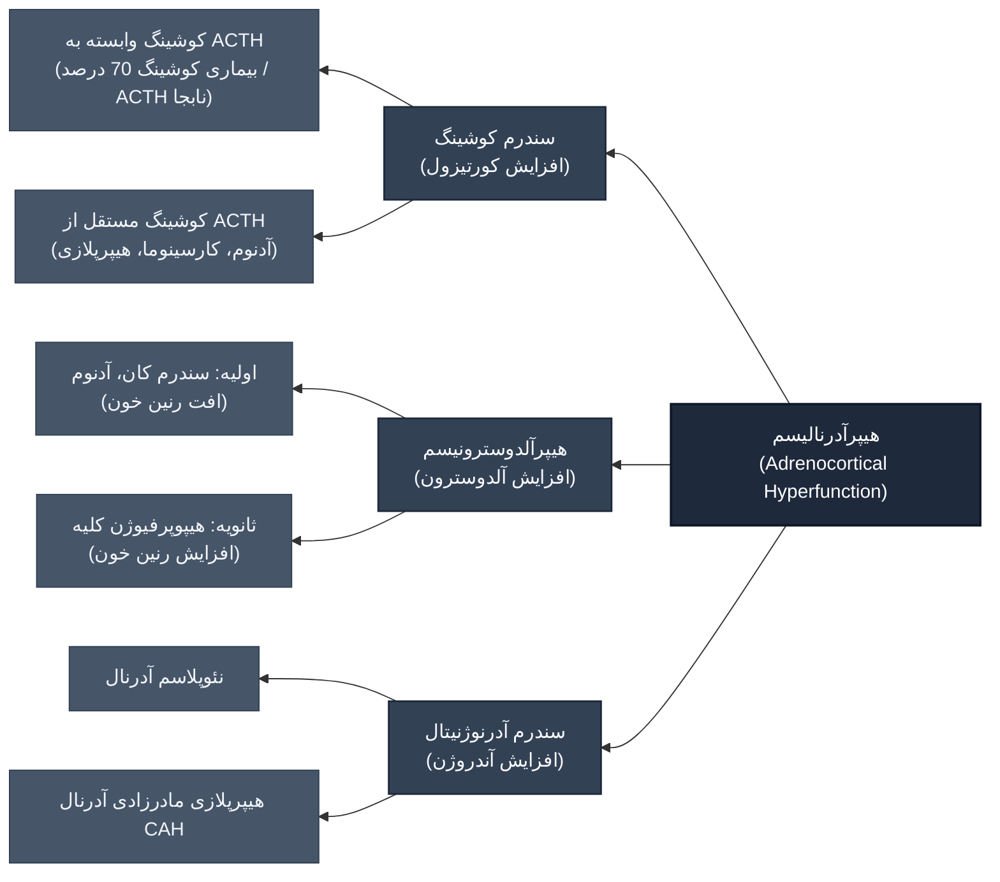
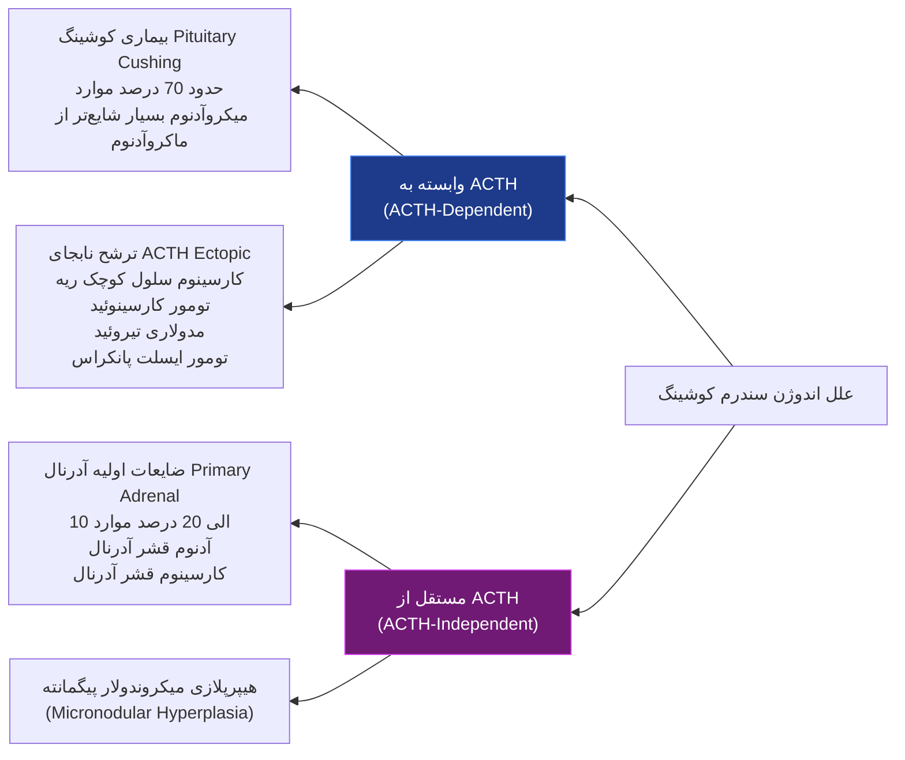
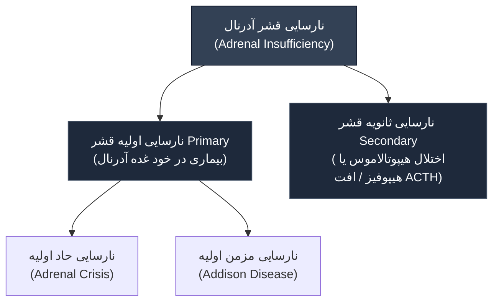
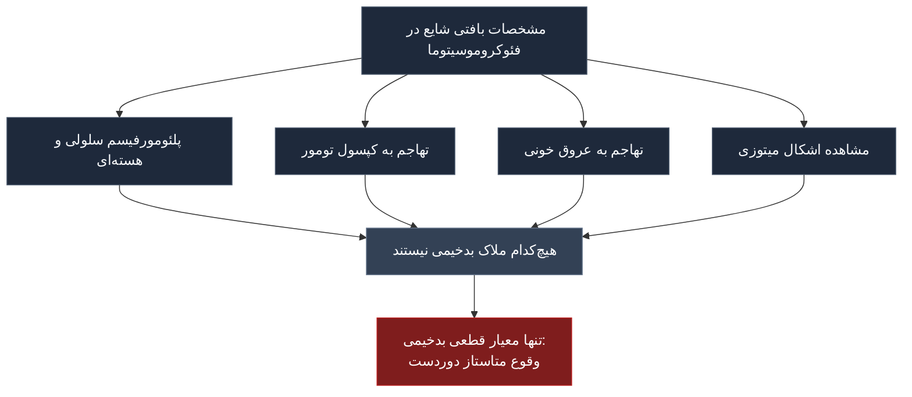
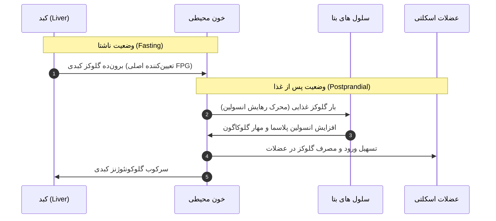
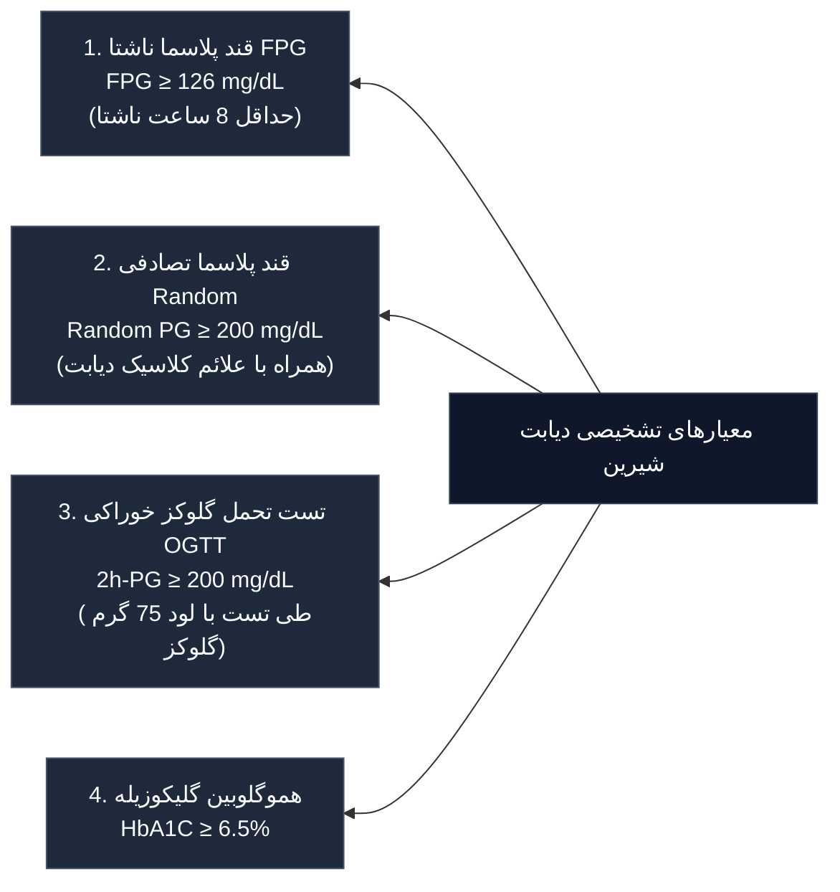
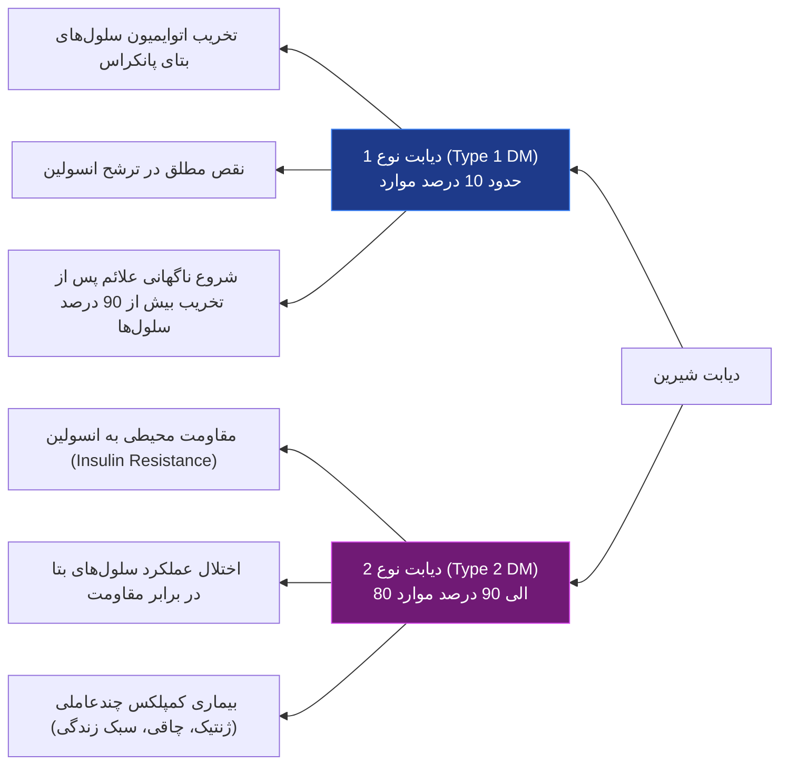

# پاتولوژی غدد آدرنال و پانکراس درون‌ریز

## بخش ۱: پاتولوژی غدد فوق کلیوی (Adrenal Glands)

### ۱.۱ آناتومی عملکردی و جنین‌شناسی
غدد فوق کلیوی (آدرنال) اعضای جفت درون‌ریز واقع در قطب فوقانی کلیه‌ها هستند. از دو جزء مستقل قشر (*Cortex*) و بصل/مدولا (*Medulla*) تشکیل شده‌اند که از لحاظ **تکامل جنینی**، **ساختار بافتی** و **عملکرد فیزیولوژیک** کاملاً متمایز هستند:
*   **قشر آدرنال (Adrenal Cortex):** با منشأ مزودرمی؛ ترشح هورمون‌های استروئیدی؛ شامل سه لایه:
    1.  **زونا گلومرولوزا (Zona Glomerulosa):** لایه خارجی؛ ترشح مینرالوکورتیکوئیدها (به‌ویژه *آلدوسترون*).
    2.  **زونا فاسیکولاتا (Zona Fasciculata):** لایه میانی؛ تشکیل‌دهنده **حدود 75% از حجم کل کورتکس**؛ ترشح گلوکوکورتیکوئیدها (*کورتیزول*).
    3.  **زونا رتیکولاریس (Zona Reticularis):** لایه داخلی مجاور مدولا؛ ترشح آندروژن‌های آدرنال.
*   **مدولای آدرنال (Adrenal Medulla):** با منشأ نورواکتودرمی (ستیغ عصبی / *Neural Crest*)؛ تشکیل شده از سلول‌های کرومافین؛ مسئول **سنتز و ترشح کاتکول‌آمین‌ها** (عمدتاً *اپی‌نفرین* و به میزان کمتر نوراپی‌نفرین).

---

### ۱.۲ پرکاری قشر آدرنال (Adrenocortical Hyperfunction / Hyperadrenalism)

> [!abstract] مفهوم هیپرآدرنالیسم (Hyperadrenalism)
> افزایش ترشح هورمون‌های استروئیدی قشر آدرنال که بسته به هورمون غالب ترشح‌شده، به سه سندرم بالینی کلاسیک تقسیم می‌شود: سندرم کوشینگ (افزایش کورتیزول)، هیپرآلدوسترونیسم (افزایش آلدوسترون) و سندرم‌های آدرنوژنیتال یا ویریلیزان (افزایش آندروژن‌ها).

---

#### ۱.۲.۱ سندرم کوشینگ (Cushing Syndrome)

##### اتیولوژی و تقسیم‌بندی علل سندرم کوشینگ
علل به دو دسته کلی **اگزوژن** (تجویز کورتیکواستروئیدهای خارجی؛ شایع‌ترین علت کلی) و **اندوژن** تقسیم می‌شوند. علل اندوژن شامل موارد زیر است:

##### مورفولوژی اختصاصی سندرم کوشینگ
ضایعات اصلی در دو ارگان **هیپوفیز** و **غدد آدرنال** متمرکز هستند:

1.  **تغییرات هیپوفیز:**
    *   تغییر شیشه‌ای یا **Crooke Hyaline Change**: شایع‌ترین تغییر ناشی از سطوح بالای گلوکوکورتیکوئیدها. در سیتوپلاسم سلول‌های تولیدکننده ACTH در هیپوفیز قدامی، گرانول‌های بازوفیل طبیعی جای خود را به انباشت رشته‌های حدواسط کراتینی هوملبن و رنگ‌پریده می‌دهند.
    *   آدنوم هیپوفیز: در بیماری کوشینگ، شیوع **میکروآدنوم بسیار بیشتر از ماکروآدنوم** است (*Microadenoma >>> Macroadenoma*).

2.  **تغییرات غدد فوق کلیوی (چهار الگوی ساختاری):**
    *   **آتروفی کورتکس (Cortical Atrophy):** ناشی از تجویز **استروئیدهای اگزوژن**. به دلیل سرکوب بازخوردی ACTH، کورتکس در هر دو غده شدیداً نازک می‌شود؛ با این حال، *زونا گلومرولوزا کاملاً حفظ می‌گردد* (زیرا عملکرد آن وابسته به رنین-آنژیوتانسین است نه ACTH).
    *   **هیپرپلازی منتشر و ندولار (Diffuse and Nodular Hyperplasia):** در **60% الی 70% موارد اندوژن** (علل وابسته به ACTH). قشر آدرنال به طور منتشره ضخیم و زرد پررنگ می‌شود که ناشی از **افزایش اندازه و تعداد سلول‌های غنی از لیپید** در زونا فاسیکولاتا و رتیکولاریس است.
    *   **نئوپلاسم‌های قشر آدرنال (آدنوم یا کارسینوما):** فرم‌های اولیه و مستقل از ACTH.
    *   **هیپرپلازی میکروندولار کورتکس با ندول‌های پیگمانته بارز:** ندول‌های تیره و قهوه‌ای حاوی لیپوفوشین در قشر آدرنال.

> [!warning] تله مهم تشخیصی و امتحانی
> در نئوپلاسم‌های تولیدکننده کورتیزول (آدنوم یا کارسینوما)، کورتکس آدرنال مجاور تومور و کورتکس غده آدرنال **طرف مقابل (Contralateral) دچار آتروفی شدید** می‌شوند؛ در حالی که در آدنوم‌های تولیدکننده آلدوسترون، کورتکس آدرنال مجاور و طرف مقابل کاملاً **طبیعی و دست‌نخورده (Unaffected)** باقی می‌مانند، زیرا ترشح آلدوسترون فیدبک منفی روی ACTH ندارد!

---

#### ۱.۲.۲ هیپرآلدوسترونیسم (Hyperaldosteronism)

> [!abstract] تعریف هیپرآلدوسترونیسم اولیه (Primary Hyperaldosteronism)
> ترشح خودمختار (Autonomous) و بیش‌ازحد آلدوسترون توسط قشر آدرنال بدون وابستگی به سیستم رنین-آنژیوتانسین، که منجر به مهار رنین پلاسما، احتباس سدیم، دفع پتاسیم و بروز **فشار خون بالای همراه با هیپوکالمی (Hypokalemic Hypertension)** می‌گردد.

##### تابلوی مقایسه‌ای جامع: هیپرآلدوسترونیسم اولیه در برابر ثانویه

| پارامتر تشخیصی | هیپرآلدوسترونیسم اولیه (Primary) | هیپرآلدوسترونیسم ثانویه (Secondary) |
| :--- | :--- | :--- |
| **مکانیسم پاتوفیزیولوژیک** | تولید خودمختار آلدوسترون در آدرنال بدون تحریک خارجی | فعال‌شدن سیستم رنین-آنژیوتانسین (RAS) به دنبال محرک‌های خارج آدرنال |
| **میزان رنین پلاسما** | **کاهش‌یافته یا سرکوب‌شده** (Low/Suppressed Renin) | **افزایش‌یافته** (High Renin) |
| **شایع‌ترین اتیولوژی‌ها** | آدنوم منفرد قشر آدرنال (سندرم کان)، هیپرپلازی دوطرفه ایدیوپاتیک | کاهش خون‌رسانی کلیه، کاهش حجم شریانی، هیپروولمی فیزیولوژیک بارداری |
| **علل زمینه‌ای اختصاصی** | 1. آدنوم کورتکس آدرنال 2. هیپرپلازی اولیه‌ی ترشح‌کننده آلدوسترون | 1. تنگی شریان کلیه (*Renal Artery Stenosis*) 2. نفواسکلروز آرتریولار 3. نارسایی احتقانی قلب (*CHF*) 4. سیروز کبدی و سندرم نفروتیک 5. بارداری (*افزایش سوبسترای رنین ناشی از استروژن*) |
| **وضعیت غده طرف مقابل** | کورتکس آدرنال طرف مقابل کاملاً دست‌نخورده و طبیعی | هر دو غده تحت تحریک آنژیوتانسین دچار هیپرپلازی منتشر می‌شوند |

##### آدنوم قشر آدرنال ترشح‌کننده آلدوسترون (Aldosterone-Producing Adenoma)
*   **ماکروسکوپی:** تقریباً همیشه **منفرد (Solitary)**، کوچک با قطر **1 تا 2 سانتی‌متر**؛ در سطح مقطع دارای رنگ **زرد تا زرد-قهوه‌ای**.
*   **میکروسکوپی:** متشکل از سلول‌های شبیه به سلول‌های طبیعی کورتکس (به‌ویژه سلول‌های غنی از چربی شبیه زونا فاسیکولاتا)؛ هسته‌ها کوچک با درجاتی از پلئومورفیسم؛ سیتوپلاسم از ائوزینوفیل تا واکوئوله متغیر؛ **فعالیت میتوزی به طور کلی ناچیز و غیرقابل‌توجه** (*Inconspicuous*).
*   **اجسام اسپیرونولاکتون (Spironolactone Bodies):** انکلوزیون‌های سیتوپلاسمی **ائوزینوفیلیک و لایه‌لایه (Laminated)**؛ اختصاصاً پس از درمان بیماران با داروی آنتاگونیست آلدوسترون (اسپیرونولاکتون) در سیتوپلاسم سلول‌های آدنوم تشکیل می‌شوند.

##### سیر بالینی هیپرآلدوسترونیسم
*   مهم‌ترین پیامد بالینی: **فشار خون بالا (Hypertension)**؛ این اختلال **شایع‌ترین علت فشار خون ثانویه** است.
*   **هیپوکالمی (Hypokalemia):** در گذشته علامت اجباری بیماری تلقی می‌شد، اما امروزه مشخص شده که بسیاری از بیماران در فازهای اولیه نورموکالمیک هستند. دفع پتاسیم منجر به ضعف عضلانی و تغییرات نوار قلب می‌شود.

---

#### ۱.۲.۳ کارسینوم قشر آدرنال (Adrenocortical Carcinoma)
تومورهای بدخیم و نادر با ویژگی‌های پاتولوژیک بسیار تهاجمی:
*   **ماکروسکوپی:** توده‌های بزرگ و مهاجم با **قطر معمولاً بیش از 20 سانتی‌متر**؛ بافت طبیعی آدرنال را محو و مخدوش می‌کنند (*Efface*). در سطح مقطع **چندشکل و متغیر (Variegated)**، فاقد حدود مشخص، همراه با مناطق وسیع **نکروز، خونریزی و تغییرات کیستیک**.
*   **میکروسکوپی:** طیف بافتی وسیع از سلول‌های تمایزیافته شبیه آدنوم کورتکس تا **سلول‌های غول‌آسا و بسیار آنامپلاستیک (Bizarre Giant Cells)**.
*   **مسیرهای تهاجم و متاستاز:** متاستاز لنفاوی به **گره‌های لنفاوی ناحیه‌ای و اطراف آئورت (Periaortic Nodes)** و انتشار دوردست هماتوژنوس به **ریه‌ها و سایر احشای شکمی**.

> [!warning] نکته پاتولوژی مهم
> **کارسینوم‌های متاستاتیک به قشر آدرنال به مراتب شایع‌تر از کارسینوم اولیه کورتکس آدرنال هستند.** منشأ تومورهای ثانویه عمدتاً سرطان‌های ریه و پستان است.

---

#### ۱.۲.۴ سندرم‌های آدرنوژنیتال (Adrenogenital / Virilizing Syndromes)

> [!abstract] تعریف سندرم آدرنوژنیتال
> گروهی از اختلالات ناشی از تولید بیش از حد آندروژن‌ها که می‌توانند ناشی از اختلالات اولیه گنادها یا نقایص اولیه آدرنال باشند.

*   **آندروژن‌های اصلی آدرنال:** *دهیدروامی‌اندرواسترون (DHEA)* و *آندروستندیون (Androstenedione)*؛ این دو هورمون در بافت‌های محیطی قابلیت تبدیل به تستوسترون دارند.
*   **علل آدرنال افزایش آندروژن:**
    1.  نئوپلاسم‌های قشر آدرنال (عمدتاً کارسینوماها و به ندرت آدنوم‌ها).
    2.  **هیپرپلازی مادرزادی آدرنال (CAH - Congenital Adrenal Hyperplasia).**

##### هیپرپلازی مادرزادی آدرنال (CAH)
*   **الگوی وراثت:** اختلال ژنتیکی **اتوزومال مغلوب (Autosomal Recessive)** ناشی از نقص در آنزیم‌های مسیر بیوسنتز کورتیزول.
*   **پاتوفیزیولوژی:** افت تولید کورتیزول ⇦ کاهش مهار فیدبکی هیپوفیز ⇦ **ترشح جبرانی شدید ACTH** ⇦ هیپرپلازی دوطرفه کورتکس آدرنال و شیفت مسیرهای سنتزی به سمت تولید فراوان آندروژن.
*   **بافت‌شناسی آدرنال در CAH:** تکثیر برجسته سلول‌های **فشرده (Compact)، ائوزینوفیلیک و فاقد چربی (Lipid-Depleted)**.
*   **تظاهرات بالینی:**
    *   بسته به نوع و شدت نقص آنزیمی، شروع علائم از **دوره نوزادی (Perinatal)، اواخر کودکی تا بزرگسالی** متغیر است.
    *   **ابهام دستگاه تناسلی (Ambiguous Genitalia):** در هر نوزادی با ابهام جنسیتی باید فوراً به CAH شک کرد.
    *   **بحران از دست دادن نمک (Salt-Wasting Crisis):** نقایص آنزیمی شدید در شیرخواران باعث کمبود همزمان آلدوسترون و گلوکوکورتیکوئیدها شده و به تابلوی مرگبار همراه با **استفراغ مکرر، دهیدراتاسیون شدید و دفع سدیم** منجر می‌شود.

---

### ۱.۳ نارسایی قشر آدرنال (Adrenal Insufficiency / Hypoadrenalism)

---

#### ۱.۳.۱ نارسایی حاد اولیه کورتکس (Primary Acute Adrenocortical Insufficiency / Adrenal Crisis)
یک اورژانس فوق‌العاده حیاتی پزشکی که در شرایط زیر رخ می‌دهد:
1.  **قطع ناگهانی درمان با کورتیکواستروئیدها** یا عدم افزایش دوز استروئید در شرایط استرس حاد (جراحی، عفونت، تروما) در فردی که آتروفی آدرنال دارد.
2.  **خونریزی وسیع و ماسیو آدرنال (Massive Adrenal Hemorrhage):** که کورتکس را تخریب کند؛ در موقعیت‌های زیر:
    *   بیماران تحت درمان با داروهای ضدانعقاد (*Anticoagulant Therapy*).
    *   بیماران پس از جراحی که دچار انعقاد داخل عروقی منتشر (*DIC*) می‌شوند.
    *   بیماران مبتلا به سپسیس برق‌آسا (*Overwhelming Sepsis*).
3.  **سندرم واترهاوس-فریدریشسن (Waterhouse-Friderichsen Syndrome).**

> [!danger] سندرم واترهاوس-فریدریشسن (Waterhouse-Friderichsen Syndrome)
> عارضه مرگبار ناشی از **عفونت باکتریایی سپسیس برق‌آسا** که به صورت کلاسیک با سپتی‌سمی نایسریا مننژیتیدیس (*Neisseria meningitidis*) شناخته می‌شود؛ اما سایر باکتری‌ها نظیر سویه‌های سودوموناس (*Pseudomonas*)، پنوموکوک، هموفیلوس آنفلوانزا (*Haemophilus influenzae*) و استافیلوکوک‌ها نیز می‌توانند عامل آن باشند.
> **سه‌گانه پاتوژنز:**
> 1. کشت مستقیم باکتری در عروق کوچک آدرنال (*Direct bacterial seeding*).
> 2. ایجاد انعقاد داخل عروقی منتشر (*DIC*).
> 3. واسکولیت با واسطه اندوتوکسین ⇦ خونریزی دوطرفه و ماسیو آدرنال همراه با کلاپس قلبی-عروقی سریع و شوک.

---

#### ۱.۳.۲ نارسایی مزمن اولیه کورتکس: بیماری آدیسون (Addison Disease)

> [!abstract] تعریف بیماری آدیسون
> اختلال پیشرونده و مزمن ناشی از تخریب کورتکس آدرنال. **علائم بالینی تا زمانی که حداقل 90% از قشر آدرنال به طور کامل تخریب نشده باشد، تظاهر پیدا نمی‌کنند.**

##### اتیولوژی بیماری آدیسون
**بیش از 90% از تمام موارد بیماری** ناشی از یکی از چهار فرآیند زیر است:
1.  **آدرنالیت خودایمنی (Autoimmune Adrenalitis):** شایع‌ترین علت در جوامع توسعه‌یافته.
2.  **سل (Tuberculosis).**
3.  **سندرم نقص ایمنی اکتسابی (AIDS).**
4.  **سرطان‌های متاستاتیک (عمدتاً کارسینوم ریه و پستان).**

##### مورفولوژی اختصاصی بیماری آدیسون بر اساس اتیولوژی
*   **آدرنالیت خودایمنی اولیه:** غدد به طور نامنظم **چروکیده و کوچک‌شده (Irregularly Shrunken)** هستند. در نمای بافت‌شناسی، کورتکس تنها حاوی سلول‌های قشری باقی‌مانده و پراکنده در یک زمینه فیبروزه است؛ یک **ارتشاح متغیر لنفوسیتی (Lymphoid Infiltrate)** در قشر مشهود است در حالی که مدولا سالم است.
*   **بیماری‌های سلی و قارچی:** ساختار ساختمانی آدرنال با **التهاب گرانولوماتوز (Granulomatous Inflammation)** همراه با نکروز کازئوز به طور کامل محو می‌شود.
*   **نئوپلاسم‌های متاستاتیک:** غدد آدرنال به شدت بزرگ شده و ساختار نرمال توسط توده‌های توموری نفوذیافته از بین می‌رود.

##### تابلوی علائم و نشانه‌های بالینی بیماری آدیسون
1.  **ضعف پیشرونده و خستگی‌پذیری زودرس (Easy Fatigability):** از اولین و برجسته‌ترین شکایات بیمار.
2.  **اختلالات گوارشی:** بی‌اشتهایی شدید (*Anorexia*)، تهوع، استفراغ، **کاهش وزن بارز** و اسهال.
3.  **هیپرپیگمانتاسیون پوست و مخاط‌ها (Hyperpigmentation):** تیرگی پوست به ویژه در نواحی تحت فشار، چین‌ها و لثه‌ها؛ علت: افزایش سطح پلاسمایی **پیش‌ساز هورمون ACTH یعنی POMC** که سنتز ملانین را در ملانوسیت‌ها تحریک می‌کند. (*منحصراً در فرم اولیه دیده می‌شود*).
4.  **کاهش فعالیت مینرالوکورتیکوئیدی:** اتلاف مداوم سدیم و ناتوانی در دفع پتاسیم ⇦ **هیپرکالمی، هیپوناترمی، کاهش حجم پلاسما (Volume Depletion) و افت فشار خون (Hypotension)**.
5.  **هیپوگلیسمی (Hypoglycemia):** ناشی از کمبود گلوکوکورتیکوئید و اختلال شدید در مسیر گلوکونئوژنز کبدی.

---

#### ۱.۳.۳ نارسایی ثانویه قشر آدرنال (Secondary Adrenocortical Insufficiency)
*   **پاتوژنز:** هرگونه اختلال در هیپوتالاموس یا هیپوفیز قدامی که منجر به **کاهش ترشح ACTH** گردد.
*   **مورفولوژی غدد آدرنال:** اندازه غدد به طور متوسط تا شدید کاهش می‌یابد. کورتکس آدرنال تا حد **یک نوار فوق‌العاده باریک (Thin Ribbon)** لاغر می‌شود.
*   **حفظ زونا گلومرولوزا:** این نوار باریک باقیمانده عمدتاً از **سلول‌های زونا گلومرولوزا** تشکیل شده است؛ زیرا این لایه توسط سیستم رنین-آنژیوتانسین تنظیم می‌شود و فقدان ACTH موجب آتروفی آن نمی‌گردد.

##### جدول مقایسه تفکیکی نارسایی اولیه (آدیسون) در برابر نارسایی ثانویه آدرنال

| پارامتر مقایسه‌ای | نارسایی اولیه (بیماری آدیسون) | نارسایی ثانویه آدرنال |
| :--- | :--- | :--- |
| **محل درگیری پاتولوژیک** | خود غده آدرنال (بیماری اولیه در کورتکس) | هیپوتالاموس یا هیپوفیز (نقص در تولید CRH یا ACTH) |
| **سطح خونی هورمون ACTH** | **افزایش شدید** (ناشی از فقدان فیدبک منفی کورتیزول) | **بسیار پایین یا غیرقابل اندازه‌گیری** |
| **پیگمانتاسیون پوست و مخاط** | **هیپرپیگمانتاسیون پوستی بارز** (به دلیل اثر ترشح مشتقات POMC) | **پوست رنگ‌پریده**؛ فقدان هیپرپیگمانتاسیون (ACTH پایین است) |
| **تعادل سدیم و پتاسیم خون** | **هیپرکالمی و هیپوناترمی شدید** (به علت تخریب کامل زونا گلومرولوزا) | **الکترولیت‌های سرم معمولاً نرمال** (ترشح آلدوسترون بدون تغییر است) |
| **پاسخ ساختاری کورتکس** | تخریب بیش از 90% بافت کورتکس (فیبروز/گرانولوم) | آتروفی فاسیکولاتا/رتیکولاریس، حفظ نوار زونا گلومرولوزا |

---

### ۱.۴ تومورهای بصل آدرنال: فئوکروموسیتوما (Pheochromocytoma)

> [!abstract] تعریف فئوکروموسیتوما
> نئوپلاسم نسبتاً نادر مدولای آدرنال، متشکل از **سلول‌های کرومافین (Chromaffin Cells)** که توانایی سنتز، ذخیره و آزادسازی خودمختار کاتکول‌آمین‌ها را دارا می‌باشند.

#### قانون ۱۰ درصد کلاسیک (The Rule of 10%)
فئوکروموسیتوما از دیرباز در پاتولوژی با قاعده ۱۰% شناخته می‌شود:
*   **10% موارد همراه با سندرم‌های فامیلیال و ژنتیکی:**
    *   سندرم نئوپلازی متعدد درون‌ریز تیپ 2A و 2B موسوم به *MEN-2A* و *MEN-2B*.
    *   نوروفیبروماتوز تیپ 1 (*Type 1 Neurofibromatosis - NF1*).
    *   سندرم فون هیپل-لیندو (*Von Hippel-Lindau - VHL*).
    *   سندرم استورج-وبر (*Sturge-Weber Syndrome*).
*   **10% موارد خارج آدرنالی هستند (Extra-adrenal):** منشأ از پاراگنگلیون‌های سمپاتیک (پاراگانگلیوما).
*   **10% موارد غیرفامیلیال آدرنال دوطرفه هستند (Bilateral).**
*   **10% فئوکروموسیتوماهای آدرنال از نظر بیولوژیک بدخیم هستند (Malignant).**
*   **10% فئوکروموسیتوماهای آدرنال در سنین کودکی رخ می‌دهند (Childhood).**

#### مورفولوژی و نمای میکروسکوپی فئوکروموسیتوما
*   **ماکروسکوپی:** ضایعات از ندول‌های کوچک و کاملاً محدود درون غده آدرنال تا توده‌های بسیار بزرگ متغیرند. ضایعات کوچک‌تر در سطح مقطع **زرد-برنزه (Yellow-Tan)**، با حدود مشخص بوده و قشر آدرنال مجاور را تحت فشار قرار می‌دهند. توده‌های بزرگ‌تر تمایل به **خونریزی، نکروز و تغییرات کیستیک** داشته و تمام ساختار طبیعی آدرنال را محو می‌کنند.
*   **معماری بافتی زلبالم (Zellballen):** مشخصه بافت‌شناسی تومور، تجمع سلول‌های چندضلعی تا دوکی‌شکل کرومافین (*Chief Cells*) در قالب لانه‌ها یا آلوئول‌های سلولی کوچک موسوم به **Zellballen** است که توسط یک **شبکه غنی و متراکم از عروق خونی و مویرگ‌ها** احاطه شده‌اند.
*   **نمای سلولی:** هسته سلول‌های نئوپلاستیک ممکن است تنوع اندازه و پلئومورفیسم شدید نشان دهد.

> [!danger] تله فوق‌العاده امتحانی پاتولوژی فئوکروموسیتوما
> حضور تهاجم کپسولی، تهاجم عروقی، پلئومورفیسم شدید هسته و حتی میتوز در تومورهای کاملاً خوش‌خیم نیز دیده می‌شود و نشان‌دهنده بدخیمی نیست! بنابراین، **تشخیص قطعی بدخیمی در فئوکروموسیتوما منحصراً و اکیداً بر اساس حضور متاستاز (به گره‌های لنفاوی، استخوان، کبد یا ریه) استوار است.**

#### سیر بالینی و تشخیص آزمایشگاهی
*   **تظاهر بالینی غالب:** **فشار خون بالا (Hypertension)**؛ ممکن است مداوم یا حمله‌ای (*Paroxysmal*) باشد.
*   **حملات پاروکسیسمال (Paroxysms):** افزایش ناگهانی و شدید فشار خون همراه با **تاکی‌کاردیا، تپش قلب (Palpitations)، سردرد ضربان‌دار، تعریق شدید (Sweating) و لرزش (Tremor)**. این حملات می‌توانند با درد شکم یا قفسه سینه، تهوع و استفراغ همراه شوند.
*   **تشخیص آزمایشگاهی (Lab Diagnosis):** اندازه‌گیری **افزایش دفع ادراری کاتکول‌آمین‌های آزاد** و متابولیت‌های نهایی آن‌ها به ویژه **وانیل‌مندلیک اسید (VMA)** و **متانفرین‌ها (Metanephrines)**.

---
---

## بخش ۲: پاتولوژی پانکراس درون‌ریز و دیابت شیرین (Endocrine Pancreas & Diabetes Mellitus)

### ۲.۱ فیزیولوژی طبیعی و هومئوستاز گلوکز

> [!abstract] جزایر لانگرهانس (Islets of Langerhans)
> بخش درون‌ریز پانکراس متشکل از حدود **1 میلیون خوشه سلولی** میکروسکوپی پراکنده در پارانشیم برون‌ریز است که چهار نوع سلول اصلی ترشحی را در بر می‌گیرد:
> 1. **سلول‌های بتا (β cells):** تولید و ترشح هورمون *انسولین*.
> 2. **سلول‌های آلفا (α cells):** ترشح *گلوکاگون*.
> 3. **سلول‌های دلتا (δ cells):** ترشح *سوماتواستاتین*.
> 4. **سلول‌های PP:** ترشح *پلی‌پپتید پانکراسی (Pancreatic Polypeptide)*.

#### ارکان تنظیم قند خون در حالت ناشتا و پس از غذا
هومئوستاز گلوکز توسط سه فرآیند درهم‌تنیده کنترل می‌گردد:
1.  **تولید گلوکز در کبد:** از طریق مسیرهای گلوکونئوژنز و گلیکوژنولیز.
2.  **برداشت و مصرف محیطی گلوکز:** که مکان اصلی آن **عضلات اسکلتی** است.
3.  **اثرات تنظیمی انسولین و هورمون‌های متضاد:** نظیر گلوکاگون.

*   **نکته کلیدی فیزیولوژی:** سطح گلوکز پلاسمای ناشتا (*FPG*) در وهله اول توسط **میزان خروجی گلوکز کبدی** تعیین می‌شود.
*   **محرک اصلی ترشح انسولین:** **گلوکز** مهم‌ترین محرکی است که رهایش انسولین از سلول‌های بتا را آغاز می‌کند.

---

### ۲.۲ طبقه‌بندی و معیارهای آزمایشگاهی دیابت و وضعیت پیش‌دیابت

> [!abstract] تعریف دیابت شیرین (Diabetes Mellitus)
> گروهی از اختلالات متابولیک با ویژگی مشترک **هیپرگلیسمی مزمن** ناشی از نقص در ترشح انسولین، اثر انسولین، یا هر دو.

##### جدول مقایسه کامل معیارهای وضعیت پیش‌دیابت (Prediabetes) و دیابت آشکار

| وضعیت بالینی | قند ناشتا پلاسما (FPG) | تست تحمل گلوکز ۲ ساعته (OGTT 75g) | هموگلوبین گلیکوزیله (HbA1C) |
| :--- | :--- | :--- | :--- |
| **طبیعی (Normal)** | کمتر از 100 mg/dL | کمتر از 140 mg/dL | کمتر از 5.7% |
| **پیش‌دیابت (Prediabetes / Impaired)** | **100 الی 125 mg/dL** (*اختلال گلوکز ناشتا - IFG*) | **140 الی 199 mg/dL** (*اختلال تحمل گلوکز - IGT*) | **5.7% الی 6.4%** |
| **دیابت قطعی (Diabetes Mellitus)** | **≥ 126 mg/dL** | **≥ 200 mg/dL** | **≥ 6.5%** |

*نکته تستی تکمیلی:* معیار چهارم دیابت قطعی، قند خون تصادفی مساوی یا بیش از **200 mg/dL** در فرد دارای علائم بالینی پرنوشی، پرادراری و کاهش وزن است.

---

### ۲.۳ پاتوژنز و تفاوت‌های بنیادین دیابت نوع ۱ و نوع ۲

---

#### ۲.۳.۱ پاتوژنز دیابت نوع ۱ (Type 1 Diabetes Mellitus)
دیابت نوع 1 یک **بیماری خودایمنی (Autoimmune)** است که با تخریب اختصاصی سلول‌های بتای پانکراس و کاهش پیشرونده توده سلولی آن‌ها شناخته می‌شود:
*   **آستانه بالینی بروز بیماری:** تظاهر بالینی دیابت نوع 1 به صورت **ناگهانی و حاد (Abrupt)** رخ می‌دهد؛ اما این تظاهر ناگهانی زمانی پدیدار می‌گردد که **بیش از 90% از سلول‌های بتا به طور کامل تخریب شده باشند**!
*   **مکانیسم ایمونولوژیک:** شکست در ایجاد تحمل به خود در لنفوسیت‌های T (*Failure of self-tolerance in T-cells*) که موجب حمله لنفوسیت‌های T سیتوتوکسیک به سلول‌های جزایر می‌شود.
*   **پاتولوژی بافتی:** ایجاد التهاب اختصاصی درون جزایر موسوم به **انسولیت (Insulitis)** که ناشی از ارتشاح سلول‌های التهابی لنفوسیتی در جزایر لانگرهانس است.
*   **اتوانتی‌بادی‌های سرمی:** به عنوان مارکرهای فعالیت خودایمنی در خون یافت می‌شوند؛ برجسته‌ترین آن‌ها شامل **اتوآنتی‌بادی علیه گلوتامیک اسید دکربوکسیلاز (GAD)**، آنتی‌بادی علیه انسولین و آنتی‌بادی علیه IA-2 است.
*   **استعداد ژنتیکی (Genetics):**
    *   **ارتباط بسیار قوی با مولکول‌های کمپلکس سازگاری بافتی کلاس دو:** **90% تا 95% از افراد سفیدپوست (Caucasians)** مبتلا به دیابت نوع 1 دارای **HLA-DR3** یا **HLA-DR4** و یا هر دو آلل هستند.
    *   **40% تا 50% بیماران هتروزیگوت DR3/DR4 هستند.**
    *   سایر ژن‌های غیر HLA درگیر در تنظیم خودایمنی: پلی‌مورفیسم در ژن **CTLA4**.
*   **فاکتورهای محیطی:** محرک‌های محیطی به‌ویژه **عفونت‌های ویروسی** که فرآیند خودایمنی را در افراد دارای استعداد ژنتیکی آغاز می‌کنند.

---

#### ۲.۳.۲ پاتوژنز دیابت نوع ۲ (Type 2 Diabetes Mellitus)
دیابت نوع 2 که شامل **80% تا 90% کل موارد دیابت** است، یک بیماری چندعاملی پیچیده (*Multifactorial Complex Disease*) پروتوتایپیک است:
*   **عوامل محیطی:** سبک زندگی کم‌تحرک، عادات نامناسب غذایی و مهم‌تر از همه **چاقی (Obesity)**.
*   **عوامل ژنتیکی:** دارای زمینه توارثی چندژنی و حتی قوی‌تر از دیابت نوع 1 (بدون ارتباط با HLA).
*   **دو نقص متابولیک اساسی و مشخصه دیابت نوع ۲:**
    1.  **مقاومت محیطی به انسولین (Insulin Resistance):** کاهش پاسخ‌دهی بافت‌های محیطی (به ویژه عضله اسکلتی، کبد و چربی) به عملکرد انسولین.
    2.  **اختلال عملکرد سلول بتا (β-cell Dysfunction):** ناتوانی پیشرونده سلول‌های بتا در ترشح کافی انسولین برای جبران مقاومت به انسولین محیطی و غلبه بر هیپرگلیسمی.

---

##### جدول مقایسه پاتوفیزیولوژیک جامع: دیابت نوع ۱ در برابر دیابت نوع ۲

| مشخصه پاتوفیزیولوژیک | دیابت نوع ۱ (Type 1 DM) | دیابت نوع ۲ (Type 2 DM) |
| :--- | :--- | :--- |
| **میزان شیوع در کل دیابتی‌ها** | حدود 10% از کل موارد | **80% الی 90% از کل موارد** |
| **مکانیسم اصلی بیماری‌زایی** | تخریب اتوایمیون سلول‌های بتا با واسطه سلول‌های T | مقاومت به انسولین محیطی + نارسایی نسبی ترشح انسولین |
| **ارتباط با آنتی‌ژن‌های لوکوسیتی انسان** | **ارتباط بسیار قوی با HLA-DR3 و HLA-DR4** | فاقد هرگونه ارتباط با ژن‌های HLA |
| **تغییرات پاتولوژیک بافتی جزایر** | **انسولیت (Insulitis)**؛ ارتشاح متراکم لنفوسیتی | کاهش نسبی سلول‌های بتا و نهایتاً **رسوب آمیلوئید** |
| **حضور اتوآنتی‌بادی‌ها** | **مثبت در بدو بیماری** (Anti-GAD, Anti-Insulin) | همواره منفی |
| **سطح انسولین خون در گردش** | شدیداً کاهش‌یافته یا صفر (نقص مطلق انسولین) | نرمال، افزایش‌یافته (در ابتدا) یا کاهش متوسط |
| **سن شایع شروع علائم** | شروع ناگهانی اکثراً در سنین کودکی و نوجوانی | شروع تدریجی عمدتاً در بزرگسالان همگام با چاقی |
